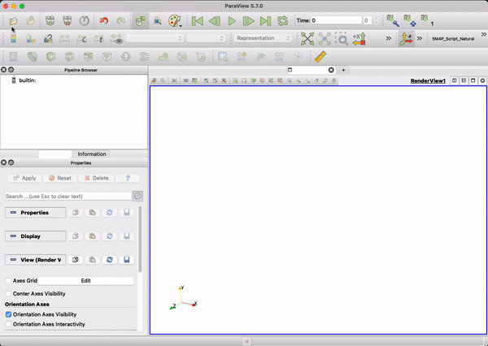
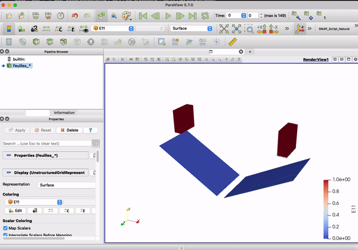
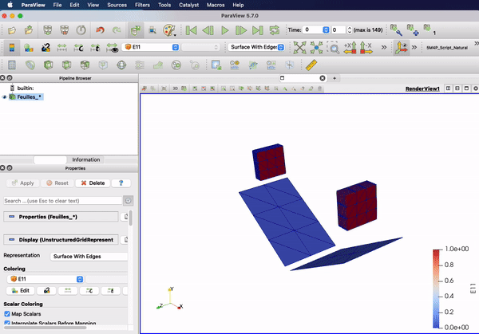

[VTU (XML Unstructured Grid)](https://docs.vtk.org/en/latest/vtk_file_formats/vtkxml_file_format.html#unstructuredgrid){:target="_blank"} is the recommended output format for results in **COMFOR**, though legacy VTK is still supported. These formats are industry standards for scientific visualization.

During the simulation, **COMFOR** writes several result files at the specified [`frequency`](preprocessing.md#output). These files are stored in the results directory defined in your input file.

**Example Folder Structure**

```console
Project_Folder
  |
  |---simulation.toml
  |---Results_Folder
  |     |--- simulation_0.vtu
  |     |--- simulation_1.vtu
  |     |--- simulation_2.vtu
       ...
```

# Load the files

To visualize the results, open **ParaView**. Click on **File → Open** and navigate to your results folder. Since **COMFOR** names files in ascending order (e.g., `file_..vtu`), ParaView will automatically propose to open them as a **file group** (time series).

<div style="text-align:center;">
    <figure>
        
        <figcaption>Loading the files</figcaption>
    </figure>
</div>

# Play the animation

After opening the files, they will appear in the **Pipeline Browser**. Click the **Apply** button in the Properties section to render the mesh.

!!! tip "Workflow Hint"
    To save time, activate **Auto Apply** in *Edit → Settings → General → Properties Panel Options*.

To play the animation, use the **Play** button on the VCR toolbar. You can navigate frame by frame, loop the animation, or jump to specific time steps using the time toolbar.

The data to be displayed (Scalars or Vectors) can be selected in the **Active Variable** dropdown menu. You can visualize nodal data (e.g., Displacement) or element data (e.g., Stress). Colors and gradients can be customized in the **Coloring** section of the Properties panel.

<div style="text-align:center;">
    <figure>
        
        <figcaption>Playing the animation</figcaption>
    </figure>
</div>

# Applying filters

ParaView provides a wide range of [filters](https://docs.paraview.org/en/latest/Tutorials/ClassroomTutorials/beginningSourcesAndFilters.html){:target="_blank"} to process and analyze simulation data. Filters can be stacked in the Pipeline Browser to combine effects.

Commonly used filters for **COMFOR** simulations:

  - **`Connectivity`**: Identifies the mesh regions that are connected. The Connectivity filter assigns a region id (point data) to connected components of the input data set. We use this filter to separate the solid regions form the composite plates.
  - **`Threshold`**: This filter extracts elements that have nodal or element data scalars in the specified range. The Threshold filter extracts the portions of the input dataset whose scalars lie within the specified range. To specify the range, select **your** Threshold filter in the Pile Browser tree and expand the `Properties(Threshold)` section in the properties menu. Select the scalar to be evaluated and fix the max an min values. Finally click apply.
  - **`Cell Data to Point Data`**: This filter allows to extrapolate element data to the nodes. It averages the values of the data of the elements surrounding a node to compute nodal information.
  - **`Temporal Interpolator`**: Interpolate the solution between to frames. Useful to obtain nice and smooth animations for presentations.
  - **`Plot Data`**: Plot data arrays from the input. This filter prepare arbitrary data to be plotted in any of the plots. By default the data is shown in a XY line plot. Use this filter to plot you csv files.

<div style="text-align:center;">
    <figure>
        
        <figcaption>Applying filters</figcaption>
    </figure>
</div>

# Resources

For in-depth ParaView training, consult these resources:

  - [Official ParaView Tutorial](https://www.paraview.org/Wiki/The_ParaView_Tutorial){:target="\_blank"}
  - [Cyprien Rusu - ParaView for FEA](https://youtube.com/playlist?list=PLvkU6i2iQ2fpcVsqaKXJT5Wjb9_ttRLK-){:target="\_blank"}
