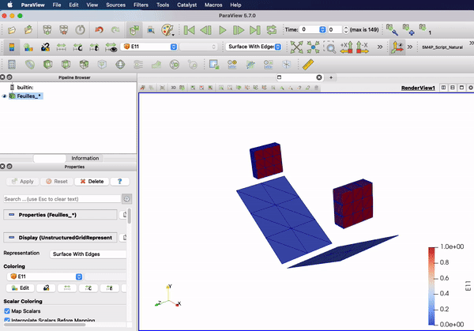

---
hide:
  - navigation
  - toc
---

  

    <h1>Comfor</h1>
    
Solution open source de mise en forme de composites, alliant précision et transparence

    <a href="overview/download/" class="md-button md-button--primary">Download</a>
  

  

    <h2>Open Source et Multiplateforme</h2>
    
<strong>Comfor</strong> est un logiciel entièrement <em>open source</em>, disponible sur Windows, Linux et macOS. Que vous soyez chercheur, étudiant ou ingénieur, vous pouvez télécharger des binaires précompilés ou le compiler depuis les sources pour l’adapter à vos besoins. Son code transparent et bien documenté vous permet de comprendre chaque étape du processus de simulation et de contribuer activement à son développement. Rejoignez une communauté dynamique qui partage des améliorations, des exemples et des conseils pour tirer le meilleur parti de Comfor.

    
<a href="https://gitlab.com/innovamics/comfor" class="md-button">Explorer le code source</a>

  

  

    
  

  

    <h2>Simulation Avancée de Matériaux Composites</h2>
    
Grâce à son <strong>solveur non-linéaire explicite</strong>, Comfor permet de modéliser des matériaux composites complexes avec une précision scientifique. Des membranes élastiques aux composites textiles anisotropes, il simule avec fiabilité les grandes déformations et les comportements dynamiques transitoires. Chaque loi de matériau, d’élément et de contact repose sur des recherches récentes, offrant une base solide pour vos projets d’ingénierie et de recherche. <em>Vous gardez un contrôle total sur vos paramètres de simulation</em>, tout en bénéficiant d’un outil robuste et performant.

    
<a href="docs/overview/" class="md-button">Découvrir les fonctionnalités</a>

  

  

    
  

  

    <h2>Visualisation Interactive des Résultats</h2>
    
Comfor s’intègre parfaitement à <strong>Paraview</strong> pour transformer vos simulations en visualisations interactives. Animez vos résultats, appliquez des filtres pour isoler des zones d’intérêt, interpolez des solutions entre les étapes et tracez vos données de manière intuitive. Cette approche facilite la <em>compréhension et la présentation des forces, déplacements et contraintes</em> dans votre modèle, rendant vos résultats à la fois précis et visuellement percutants.

    
<a href="docs/postprocessing" class="md-button">Voir la visualisation</a>

  

  

    
  

  

    <h2>Conçu pour la recherche et l’innovation</h2>
    
Comfor s’adresse aussi bien aux laboratoires de recherche qu’aux acteurs industriels. Avec une <strong>version Communauté</strong> pour les projets académiques et une <strong>version Entreprise</strong> pour les applications industrielles exigeantes, il offre flexibilité, performance et robustesse. Les chercheurs et les ingénieurs peuvent également accéder à des services d’expertise, des formations et des collaborations pour enrichir les fonctionnalités de Comfor et faire progresser la simulation des matériaux composites.

    
<a href="collaborate/industry/" class="md-button">Découvrir les versions et services</a>

  

  

    
  

# Comparatif des éditions de Comfor

  

    <h2 style="margin-top: 0.5rem; font-size: 1.4rem; font-weight: 500; color: var(--md-default-fg-color);">Comfor Community</h2>
    
Gratuit et open source

    <ul style="list-style: none; padding: 0; text-align: left;">
      <li>✔ Performances standards</li>
      <li>✔ Adapté aux petites équipes</li>
      <li>✔ Support communautaire</li>
      <li>✔ Options de configuration de base</li>
      <li>✔ Ensemble d’outils standard</li>
    </ul>
    
Parfait pour les étudiants, particuliers ou petites équipes

    <a class="md-button md-raised" href="overview/download/" style="margin-top: 1rem;">Télécharger</a>
  

  

    <h2 style="margin-top: 0.5rem; font-size: 1.4rem; font-weight: 500; color: var(--md-default-fg-color);">Comfor Enterprise</h2>
    
Édition professionnelle

    <ul style="list-style: none; padding: 0; text-align: left;">
      <li>✔ Performances optimisées pour les grands environnements</li>
      <li>✔ Evolutivité adaptée aux grandes structures</li>
      <li>✔ Support prioritaire dédié</li>
      <li>✔ Options de configuration et de déploiement avancées</li>
      <li>✔ Outils et modules supplémentaires</li>
    </ul>
    
Idéal pour les grandes entreprises et équipes industrielles

    <a class="md-button md-raised" href="collaborate/industry/#comfor_entreprise" style="margin-top: 1rem;">En savoir plus</a>
  

# Partenaires académiques

  

    
    
    
    
    
    
    
    
  

# Licence et crédits

 Documentation Comfor par <a xmlns:cc="http://creativecommons.org/ns#"
href="https://egm_foss.gitlab.io/about_me/" property="cc:attributionName"
rel="cc:attributionURL">Eduardo Guzman</a> est sous licence <a rel="license"
href="http://creativecommons.org/licenses/by-sa/4.0/">Creative Commons Attribution - Partage dans les Mêmes Conditions 4.0 International</a>. Basé sur le travail disponible à <a
xmlns:dct="http://purl.org/dc/terms/"
href="https://gitlab.com/comfor/comfor-doc"
rel="dct:source">https://gitlab.com/comfor/comfor-doc</a>.
