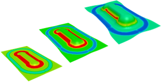

# Welcome !

{ align=right }
Comfor is an Explicit FEM code written in C++. The aim of this software is to provide a innovative general solution for modelling composite processes. Comfor is being designed to be highly modular and adapted for both, industrial and research applications.

We are proud of being the only composite software vendor that provides source code. As there should not be secrets in physics, the source code of all equations and physical models implemented in comfor are available to researchers. It is our hope that our openness would allow more researchers get involved in the development of physical models much needed in industry. Please feel free to check out a copy of the open source edition on the downloads page.

## Getting started

The [Quick starter guide](overview/quick_starter_guide.md) gives the bare minimum needed to get things working. To start building your own models you can look at the [User guide](user/user_overview).

## Overview

**Comfor is written in C++**

- C++ is an Object Oriented language. It's possible to design a highly modular design. All material physical models, will be implemented as dynamic linkable libraries. Users can replaced them with custom developed physical modelling.
- C++ is robuste and performant.
- Parallel computation ca be implemented using OpenMP in a straightforward manner.

**Comfor is a cross platform**

Using tools like cmake, we can provide a cross platform solution. Currently Comfor has been compiled an tested for the following architectures.

- Ubuntu 18.04/20.04 
    - Gcc 10.2
    - Clang 11.0.3
    - Clang 12.0.0
- OSX
    - Clang 11.0.3
    - Clang 12.0.0
- Windows 7
    - GCC 10.2.0 from MSYS2/MinGW64
    - Visual Studio 2019 (amd64, x86_amd64)

**Comfor is open source**

We believe in open source solutions. Put some principles:

More about licensing (ref to license )

## Users

In the user documentation you will learn how to build, run and analyse your first simulation. If you need some scientific background about composite processing and finite element simulation you can visit the [theory documentation]().

## Developers

So, you want to be part of the community? Great, you will find in the developers guide all the the necessary information and tools about the project. Lets innovate together !

## [Contact]() 

