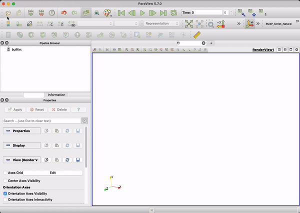

Dans ce tutoriel, nous allons parcourir un exemple complet avec **Comfor** — depuis le fichier d'entrée jusqu'à la visualisation des résultats dans ParaView.

Vous apprendrez à :

- Lancer un exemple existant fourni avec Comfor
- Comprendre la structure de base d’un fichier d’entrée
- Visualiser les résultats dans ParaView

# Présentation de l’exemple

Pour ce tutoriel, nous utiliserons l’exemple `Feuilles`, téléchargeable depuis la [page de téléchargement de Comfor](download_page.md#exemples).

Après avoir extrait l’archive, la structure du dossier `Feuilles` est la suivante :

```text
examples/Feuilles/
 ├── Feuilles.txt        # Fichier d’entrée pour la simulation
 └── Results_Feuilles/   # Dossier de sortie (créé après l’exécution de Comfor)
```

Le fichier d'entrée est `Feuilles.txt`, qui définit l’ensemble du modèle à simuler.

# Le fichier d’entrée

Voici une version simplifiée du fichier `Feuilles.txt` :

```xml
CONTROL
RUN FROM 0.0 TO 15.0
PRINT EVERY 0.1

MATERIAL TYPE HYPERELASTIC
MAT_HYPER RHO = 0.00001 DAMPING = 5.0 TYPE = OGDEN MU = [ -0.09, 13.9, -0.20 ] ALPHA = [ -13.7, 0.10, 5.06 ]

NODES
1	X= 0.0	Y= 0.0	Z= 0.0	LOAD = GRAVITY
2	X= 1.0	Y= 1.0	Z= 0.0	LOAD = GRAVITY
3	X= 2.0	Y= 2.0	Z= 0.0	LOAD = GRAVITY

ELEMENTS TYPE MEMBRANE_3
1	nodes = [1,2,3] MATERIAL = MAT_HYPER T = 1.0 FACTOR = 10.0 CONTACT = EDGE
```

Chaque section (ou *bloc*) définit une partie différente de la simulation :

* `CONTROL` — définit le temps de simulation et la fréquence de sortie
* `MATERIAL` — définit les propriétés des matériaux
* `NODES` et `ELEMENTS` — définissent le maillage et la connectivité
* `CONSTRAINT` et `LOAD` — appliquent les conditions aux limites et les charges

Pour la description complète de tous les blocs disponibles, consultez la [documentation sur les fichiers d’entrée](../docs/docs_preprocessing.md).

# Exécution de la simulation

Avant de lancer la simulation, déplacez l’exécutable Comfor (`.exe`) dans le dossier de l’exemple. Cela permet d’accéder facilement au fichier d’entrée sans devoir spécifier un chemin long.

1. Ouvrez un terminal (ou l’invite de commandes) dans le dossier de l’exemple

2. Lancez l’exécutable :
    ```bash
    comfor.exe
    ```

    !!! note
        Remplacez `comfor.exe` par le nom réel de votre fichier exécutable si celui-ci est différent.

3. Lorsque le programme démarre, il vous demandera le chemin du fichier d’entrée. Dans cet exemple, le fichier d’entrée se trouve dans le dossier `Feuilles`, tapez donc :
    ```text
    Feuilles/Feuilles.txt
    ```

Comfor lira alors le fichier d’entrée et démarrera la simulation.

<figure>
  
  <figcaption>Exemple de l’exécution de Comfor dans le terminal</figcaption>
</figure>

Pendant l’exécution, Comfor affiche des informations sur la progression de la simulation, par exemple :

```console
=================================
Elapsed time: 0.23s
Current time: 5.0
Internal energy: 3.24
Kinetic energy: 0.12
=================================
```

Lorsque le calcul est terminé, un dossier de résultats (par exemple `Results_Feuilles/`) apparaît dans le même répertoire. Ce dossier contient les fichiers `.vtk` générés, pouvant être visualisés dans ParaView.

!!! note
    Il est également possible de garder l’exécutable ailleurs et de fournir le **chemin complet** du fichier d’entrée lorsqu’il est demandé.
    Cependant, déplacer le `.exe` dans le dossier de l’exemple simplifie l'exécution pour les débutants.

# Visualisation des résultats dans ParaView

Pour ouvrir les résultats dans ParaView :

1. Lancez ParaView
2. Allez dans **Fichier → Ouvrir**
3. Sélectionnez le dossier `Results_Feuilles/`
4. Choisissez tous les fichiers `.vtk`
5. Cliquez sur **Appliquer**

Si rien n’apparaît, vérifiez que l’icône « œil » à côté du dataset est activée.

!!! hint
    Activez **Auto Apply** dans *Edition → Préférences → Général → Options du panneau de propriétés*
    pour appliquer automatiquement les modifications dans ParaView.

<figure>
  
  <figcaption>Ouverture des fichiers VTK dans ParaView</figcaption>
</figure>

Vous pouvez maintenant lancer l’animation à l’aide des contrôles de lecture dans la barre VCR.
La barre temporelle affiche le temps courant de la simulation.

# Prochaines étapes

Vous avez maintenant terminé votre première simulation avec Comfor.

Pour en savoir plus :

* [Documentation générale](../docs/docs_overview.md)
* [Modèles de matériaux](../docs/docs_materials.md)
