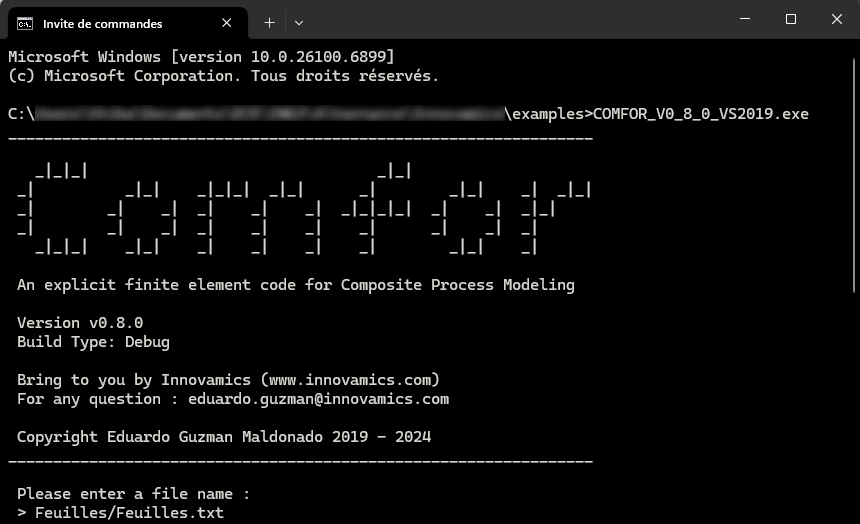

In this tutorial, we will go through a complete example using **Comfor** — from input file to result visualization in ParaView.

You will learn how to:

- Run an existing example provided with Comfor
- Understand the basic structure of an input file
- Visualize results in ParaView

# Example Overview

For this tutorial, we will use the `Feuilles` example, which can be downloaded from the [Comfor Download page](download_page.md#examples).

After extracting the archive, the `Feuilles` folder structure is:

```text
examples/Feuilles/
 ├── Feuilles.txt        # Input file for the simulation
 └── Results_Feuilles/   # Output directory (created after running Comfor)
```

The input file is `Feuilles.txt`, which defines the entire model to be simulated.

# The Input File

Here is a simplified version of the `Feuilles.txt` file:

```xml
CONTROL
RUN FROM 0.0 TO 15.0
PRINT EVERY 0.1

MATERIAL TYPE HYPERELASTIC
MAT_HYPER RHO = 0.00001 DAMPING = 5.0 TYPE = OGDEN MU = [ -0.09, 13.9, -0.20 ] ALPHA = [ -13.7, 0.10, 5.06 ]

NODES
1	X= 0.0	Y= 0.0	Z= 0.0	LOAD = GRAVITY
2	X= 1.0	Y= 1.0	Z= 0.0	LOAD = GRAVITY
3	X= 2.0	Y= 2.0	Z= 0.0	LOAD = GRAVITY

ELEMENTS TYPE MEMBRANE_3
1	nodes = [1,2,3] MATERIAL = MAT_HYPER T = 1.0 FACTOR = 10.0 CONTACT = EDGE
```

Each section (or *block*) defines a different part of the simulation:

- `CONTROL` — defines simulation time and output frequency
- `MATERIAL` — defines material properties
- `NODES` and `ELEMENTS` — define the mesh and connectivity
- `CONSTRAINT` and `LOAD` — apply boundary conditions and loads

For the full description of all available blocks, see [Input file reference](../docs/docs_preprocessing.md).

# Running the Simulation

Before running the simulation, we move the Comfor executable (`.exe`) into the example directory. This makes it easier to access the input file directly without specifying a long path.

1. Open a terminal (or Command Prompt) inside the example folder

2. Run the executable:
    ```bash
    comfor.exe
    ```
    
    !!! note
        Replace `comfor.exe` with the actual name of your executable file if it is different.

3. When the program starts, it will ask for the path to the input file. In this example, the input file is located in the `Feuilles` folder, so type:
    ```text
    Feuilles/Feuilles.txt
    ```

Comfor will then read the input file and start the simulation.

<figure>
  
  <figcaption>Running Comfor in the terminal</figcaption>
</figure>

During execution, Comfor displays information about the simulation progress, for example:

```console
=================================
Elapsed time: 0.23s
Current time: 5.0
Internal energy: 3.24
Kinetic energy: 0.12
=================================
```

When the computation is finished, a results folder (e.g. `Results_Feuilles/`) will appear in the same directory. This folder contains the generated `.vtk` files that can be visualized in ParaView.

!!! note
    It is also possible to keep the executable elsewhere and provide the **full path** to the input file when prompted.
    However, moving the `.exe` into the example folder simplifies the workflow for beginners.

# Visualizing Results in ParaView

To open the results in ParaView:

1. Launch ParaView
2. Go to **File → Open**
3. Select the directory `Results_Feuilles/`
4. Choose all `.vtk` files
5. Click **Apply**

If nothing appears, make sure the “eye” icon next to the dataset is enabled.

!!! hint
    Enable **Auto Apply** in *Edit → Settings → General → Properties Panel Options*
    to automatically apply changes in ParaView.

<figure>
  
  <figcaption>Opening the VTK result files in ParaView</figcaption>
</figure>

You can now play the animation using the playback controls in the VCR bar.
The time bar will display the current simulation time.

# Next Steps

You have now completed your first Comfor simulation.

To learn more:

- [Overview Documentation](../docs/docs_overview.md)
- [Material Models](../docs/docs_materials.md)
