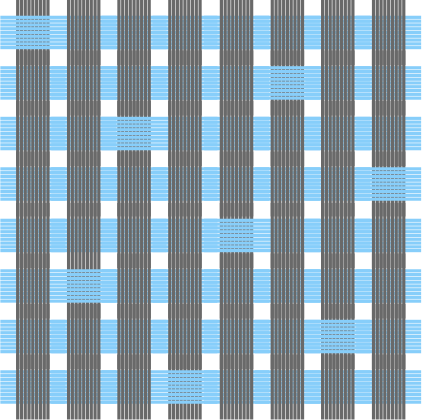
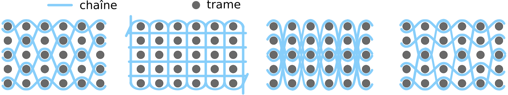
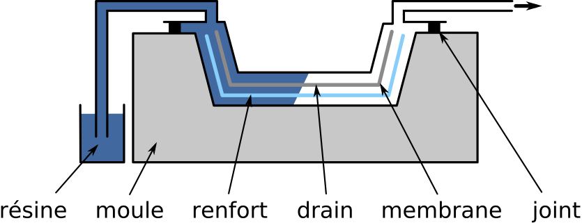
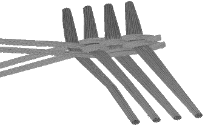
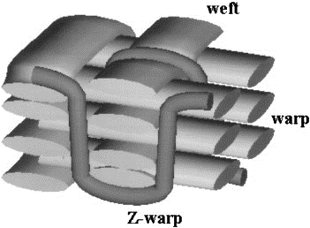
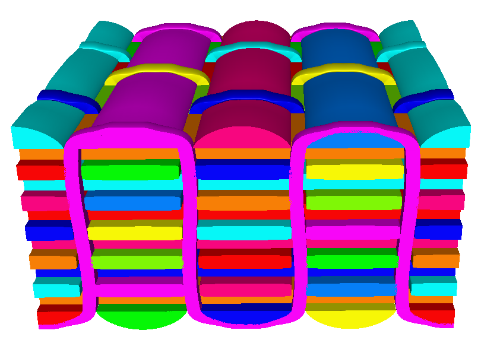
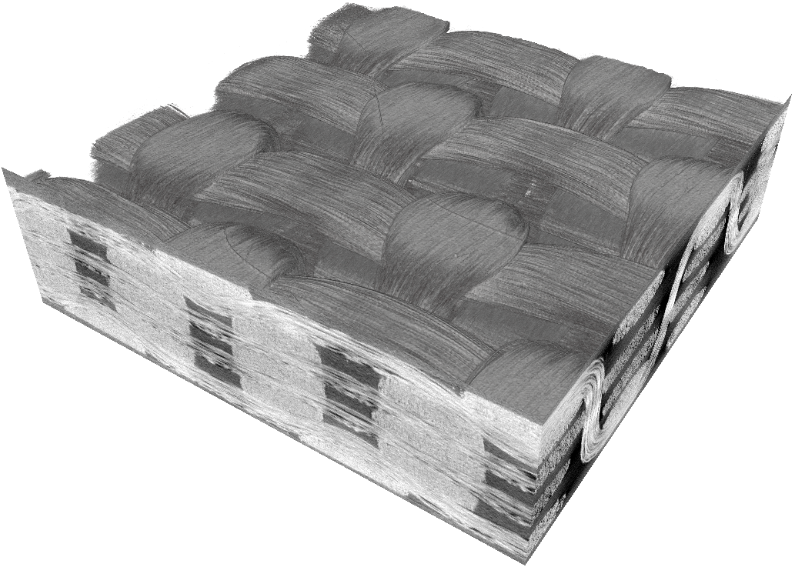
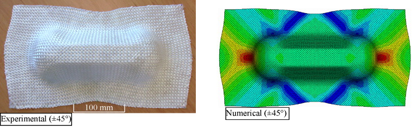
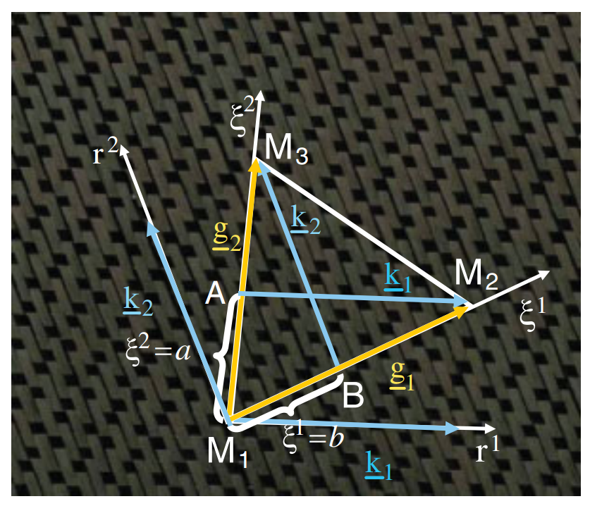
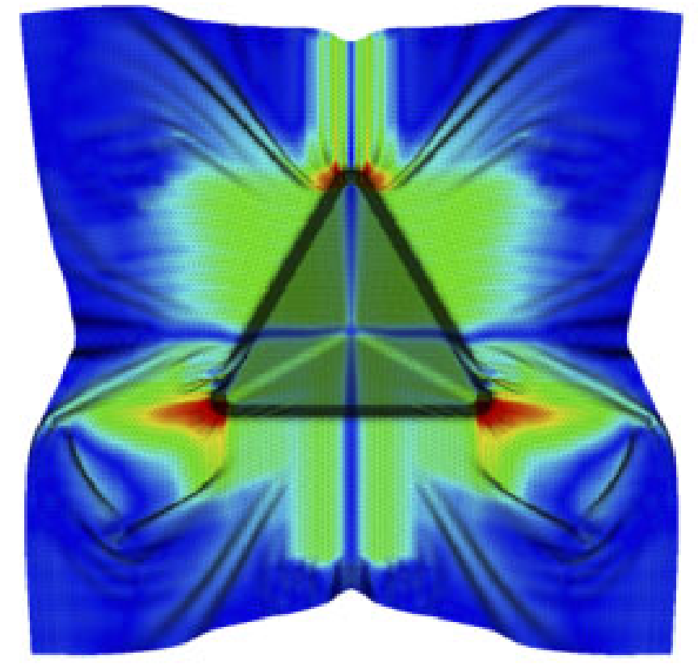

Un matériau composite est un assemblage d’au moins deux constituants non
miscibles dont les propriétés répondent à des besoins spécifiques non satisfaits
individuellement par les composants de base. Cette définition inclut un large
éventail de matériaux, certains naturels et utilisés depuis longtemps tels que
le bois, les os ou le torchis, et d’autres conçus plus récemment, comme les
pneumatiques ou le béton armé. Tous ces matériaux ont en commun le fait d’être
composés de deux constituants : le **renfort**, qui confère au produit final ses
principales caractéristiques mécaniques, et la **matrice**, qui assure la
cohésion de l’ensemble. Le souhait d’utiliser des matériaux spécifiques à chaque
application, dans l’optique d’optimiser à la fois les coûts et les performances
mécaniques, fait des composites un candidat sérieux.

Les matrices des matériaux composites développés actuellement sont généralement
classées en deux catégories :

- **Les matrices organiques** (polymères thermoplastiques, thermodurcissables et
  élastomères). Elles représentent la très grande majorité des matrices
  utilisées industriellement grâce à leurs faibles coûts et à la facilité de
  leur mise en œuvre.

- **Les matrices minérales** (céramiques et métalliques). Les matrices
  céramiques et métalliques sont destinées à des applications de pointe. Elles
  sont utilisées lorsque les conditions environnementales ne permettent pas
  l’emploi d’une matrice organique (températures élevées, hygrométrie
  défavorable).

Les renforts peuvent également être classés, cette fois en fonction de leur
géométrie :

- **Les renforts particulaires** : la matrice est renforcée par une phase
  dispersée de particules avec ou sans orientation privilégiée. Il s’agit
  généralement d’inclusions granulaires (craie), lamellaires (talc, mica) ou
  aciculaires (wollastonite, fibres courtes). Les composites à renfort
  particulaire sont peu utilisés à des fins structurelles, mais plutôt pour des
  applications spécifiques ou encore pour des produits de grande consommation.

- **Les renforts à fibres discontinues** : la matrice est renforcée par une
  phase dispersée de fibres courtes (de longueurs inférieures à 100 fois leur
  diamètre) avec ou sans orientation privilégiée. Les fibres courtes sont
  assemblées en nappes appelées mats et représentent un apport volumique en
  fibres de l’ordre de 30 %. Le composite obtenu est alors un polymère renforcé.

- **Les renforts à fibres continues** : la matrice est renforcée par une phase
  dispersée de fibres continues dont la longueur est voisine de celle de la
  pièce finale. Les directions privilégiées des fibres confèrent à la pièce
  finale ses principales caractéristiques mécaniques. Dans ce type de renfort,
  la matrice n’est présente que pour assurer la cohésion de l’ensemble et
  apporter une résistance aux efforts appliqués dans des directions différentes
  de celles des fibres.

# Les matériaux composites à fibres continues et matrice organique

Les matériaux composites à fibres continues et matrice organique sont largement
répandus dans l’industrie, notamment dans les secteurs militaire [@BHA16],
aéronautique ou encore dans la construction navale [@SMI90] [@MOU01]. Depuis
quelques années, le secteur automobile montre également un intérêt croissant
pour ces matériaux afin de réduire la masse des véhicules [@VER06] [@FUC08].

## The reinforcement

## Le renfort

Selon l’usage prévu pour la fibre, plusieurs types de compositions peuvent être
utilisés comme matière première. **Les fibres** doivent d’abord être produites,
puis assemblées en **meches** qui seront ensuite entrelacés selon différents
motifs de tissage pour former le **renfort**.

L’architecture du tissage du renfort peut être 2D (surface), 2.5D (entrelacs) ou
3D (trois dimensions). Le tissage 2D correspond à un entrelacement de mèches
selon deux directions : la chaîne et la trame. Le type de disposition utilisé
est appelé motif de tissage, et constitue le textile traditionnellement utilisé
dans l’industrie. Dans le cas des tissages 3D, une troisième direction est
ajoutée dans l’épaisseur du renfort. Enfin, les tissages dits 2.5D se situent à
la frontière entre les tissages 2D et 3D : les fils de chaîne vont chercher dans
les couches supérieures et inférieures une ou plusieurs trames afin de lier les
couches entre elles.

Selon le procédé de fabrication, l’ajout de la matrice peut se faire avant
l’étape de formage, comme dans le cas du thermoformage, ou après, comme dans les
procédés de type LCM (Liquid Composite Moulding).

Pour les tissus 2D, on distingue principalement trois types de tissage :

- _Toile_ ou _taffetas_ : le tissage le plus simple, chaque fil de chaîne passe
  alternativement au-dessus et en dessous de chaque fil de trame.

- _Serge_ NxM : le fil de trame passe au-dessus de N fils de chaîne puis en
  dessous de M, en décalant d’un fil à chaque passage.

- _Satin_ : les points de liage entre chaîne et trame sont répartis afin de
  réduire l’effet diagonal typique de la serge. Le fil de trame passe au-dessus
  de N fils de chaîne puis en dessous d’un seul.

  <figure>
    
    <figcaption>Taffeta</figcaption>
  </figure>
  <figure>
    
    <figcaption>Serge</figcaption>
  </figure>
  <figure>
    
    <figcaption>Satin</figcaption>
  </figure>

La combinaison de ces trois familles d'armures et de matériaux permet d'obtenir
une grande diversité de renforts tissés. Si le renfort est identique dans la
direction chaîne et dans la direction trame, on parle de tissu équilibré. De
façon générale, un tissu peut être caractérisé par son armure, la disposition
relative des chaînes et des trames, et son embuvage. Ce dernier se définie par
le rapport de la longueur du tissu dans une direction sur la longueur d'une
mèche dans cette même direction.

Différentes études [@BUE01] [@BOI01] [@LOM05] [@HIV08] ont montré l'influence
fondamentale de l'embuvage sur le comportement mécanique des renforts.
L'embuvage est donné par

$$
e = \frac{l_{\text{yarn}}-l_{\text{weave}}}{l_\text{yarn}}
$$

Des pièces épaisses peuvent être réalisées grâce à ces armures 2D en les
superposant. La structure ainsi obtenue permet d'optimiser la raideur du
matériau fini en agissant sur l'orientation des plis. Cependant, dans cette
configuration, la structure finale est sujette au délaminage.

Dans le cas de tissés 3D et 2.5D, les mèches de trame croisent plusieurs plans
de mèches de chaîne dans l'épaisseur du matériau. Le tissé obtenu peut alors
atteindre des épaisseurs de l'ordre de la dizaine de centimètres et permet
d'éviter le délaminage. [@GU02]:

 <figure >
   
   <figcaption>Armures de renforts 3D</figcaption>
 </figure> 

## La matrice

matériaux sont composés d'une série d'unités de répétitions appelées
*monomères*, qui s'associent lors d'une réaction chimique connue comme
polymérisation pour former des *chaînes* macromoléculaires. Les polymères les
plus utilisés pour les matrices des matériaux composites appartiennent à la
famille des thermodurcissables et des thermoplastiques.

### Thermodurcissables

Les résines polymères thermodurcissables sont composées de chaînes
macromoléculaires réticulées ou tridimensionnelles. Avant traitement
thermique, la résine se trouve dans un état liquide ou pâteux solubles à
température ambiante, ce qui favorise sa manipulation et l'imprégnation
des fibres.

Après avoir subi un cycle de chauffage connu comme cycle de
polymérisation ou cycle de réticulation, la résine devient
irréversiblement solide. Ainsi, les pièces composites thermodurcissables
ne peuvent être mises en forme qu'une seule fois puisque la matrice
devient infusible et insoluble après polymérisation.

Les résines thermodurcissables sont les plus utilisées dans l'industrie
et présentent des bonnes propriétés mécaniques et une bonne résistance.

### Thermoplastiques

Les matrices thermoplastiques sont composées de chaînes linéaires ou
unidimensionnelles et de chaînes ramifiées ou bidimensionnelles. À la différence
des résines thermodurcissables, le matériau se trouve généralement à l'état
solide sous température ambiante. Sous l'action de la chaleur, le polymère peut
être ramolli puis fondu et déformé et peut toutefois retrouver son état solide
initial par refroidissement sans aucune modification chimique (sous certaines
conditions, e.g oxydation). Le processus de transformation est réversible et,
par conséquent, la matière et les pièces fabriquées peuvent être potentiellement
recyclées.

Face aux matrices thermodurcissables, les composites à matrice thermoplastiques
pressentent de nombreux avantages:

- Propriétés mécaniques égales ou supérieures.
- Un cycle de mise en forme plus court.
- Une plus grande facilité de stockage.
- Réversibilité et recyclage.

Le développement industriel des structures en composite à matrice
thermoplastique est aujourd'hui en plein essor. Ce manuscrit fait partie des
nombreux travaux qui sont en cours de développement pour industrialiser la
fabrication de tels produits.

## Les préimprégnés

Les préimprégnés ou prépreg est le résultat de la combinaison du renfort et d'un
polymère thermoplastique ou thermodurcissable déjà réunis avant la mise en
forme.

Comme mentionné précédemment, un des avantages des thermodurcissables est la
bonne imprégnation de fibres de par sa faible viscosité à température ambiante;
alors que les thermoplastiques doivent être chauffés au-delà de la température
de fusion et nécessite une phase de compaction sur une longue durée afin
d'imprégner correctement les fibres. Cette étape affecte le cycle de mise en
forme en augmentant le temps de consolidation, nécessaire à la suppression des
porosités par compaction.

# Procédés de fabrication

Les procédés de fabrication des matériaux composites sont nombreux et
variés. Depuis des procédés essentiellement manuels, les techniques
n'ont cessé d'évoluer pour répondre à l'utilisation croissante de ces
matériaux. Les besoins de cadences de plus en plus élevées, ou encore de
pièces aux caractéristiques mieux maîtrisées, optimisées, ont mené à
différents types de procédés qui sont choisis en fonction du besoin
(forme, cadence, série, caractéristiques mécaniques, etc). Les
opérations de formage décrites par la suite sont basées sur le principe
du moulage, procédé qui permet l'obtention des structures à géométrie
non développable.

Comme mentionné précédemment, suivant le procède de fabrication, l'ajout
de la matrice a lieu avant ou après la déformation du renfort. Les
principaux procédés utilisés dans chaque cas seront brièvement décrites
par la suite.

## Liquid Composite Moulding

Les procédés de type LCM (Liquid Composite Moulding) permettent de mettre en
forme les composites à renforts tissés et à matrice polymère. Parmi ces
procédés, l'infusion sous vide et le RTM (Resin Transfer Moulding, [@POT99])
sont les plus utilisés. Le principe de ces procédés est de mouler le renfort
sec, puis d'injecter la résine pour solidifier la pièce. Le fait de mouler le
renfort sec permet d'obtenir une pièce composite finale très proche de la pièce
désirée, et ainsi de minimiser les étapes d'usinage et donc les coûts. Ces
procédés, dits *procédés moule fermé*, permettent un contrôle strict des
composés organiques volatiles émis lors de la fabrication, la résine n'étant
alors pas en contact direct avec l'atmosphère.

## L'infusion sous vide

En infusion sous vide, le renfort tissé sec est placé entre un moule et une
membrane étanche. En mettant sous vide cette zone, la pompe va plaquer le
renfort contre le moule grâce à la membrane et amorcer l'écoulement de la
résine. Un filet de drainage, réalisé dans un matériau poreux, est placé à
proximité du renfort de manière à faciliter la distribution de la résine. Ce
procédé est plus facile à mettre en œuvre que le RTM, et autorise la production
de pièces en grande série avec une bonne répétabilité sur des formes complexes.
Cependant, le contrôle de l'épaisseur est difficile et l'état de surface du côté
de la membrane est généralement moins bon que le côté moulé.

 <figure >
   
   <figcaption>Processus d'infusion sous vide</figcaption>
 </figure> 

## Resin transfer moulding

Le processus de fabrication peut être décomposé en trois étapes . La première
étape est l'étape de préformage. Elle consiste, à partir d'un renfort tissé, à
le mettre en forme (ou à l'emboutir) dans un moule par l'intermédiaire d'un
poinçon. L'avantage de ce procédé est de disposer de deux parties rigides qui
vont permettre de mieux contrôler la compression du renfort pendant la mise en
forme et donc son épaisseur finale. Contrairement à l'infusion sous vide, l'état
de surface est alors bon des deux côtés. Afin d'éviter la formation de plis
pendant l'emboutissage, des serre-flancs peuvent être utilisés en ajoutant une
légère tension dans les mèches.

Une fois le renfort moulé dans la forme désirée, la résine est injectée.
L'ensemble est ensuite chauffé pour polymériser la résine. Finalement, lorsque
la résine est consolidée, le moule est ouvert et la pièce démoulée.

Ce procédé connaît un fort développement dans l'objectif d'être utilisé pour des
pièces en grande série car il permet une maîtrise du taux volumique de fibre, un
bon état de surface, la création de géométries complexes et des cadences de
fabrication soutenues et automatisées. Cependant, malgré son utilisation dans
l'industrie, ce procédé n'est pas totalement contrôlé pour des formes complexes
(non développables par exemple) ou de grandes tailles. Ces éléments conduisent
aujourd'hui les industriels des secteurs aérospatiaux et automobiles à porter un
grand intérêt au développement et à la recherche associés au procédé.

 <figure >
   
   <figcaption>Processus RTM </figcaption>
 </figure> 

## Thermoforming

Afin d'exploiter dans un contexte industriel les excellentes propriétés des
composites CFRTP, différents procédés de fabrication ont été développés en
fonction du produit et de son application. La plupart de ces méthodes sont une
adaptation des procédés pour la mise en forme des composites thermodurcissables
ou des techniques d'emboutissage classiques. Dans les cas de la mise en forme
des structures plates, la mise en forme par rouleaux et la compression simple
ont déjà été mentionnées. Dans le cas des structures à section constante, on
peut citer le formage par pultrusion, qui est un procédé de fabrication en
continu où le profilé est obtenu par tirage du renfort préimprégné à travers une
matrice chauffée, ou encore, la mise en forme par enroulement filamentaire
(filament Winding) [@MAC12]. Ces procédés permettent en effet la mise en forme
des pièces simples (1D et 2D) et sont facilement automatisables. Afin de
fabriquer des structures à géométrie non développable (3D), le thermoformage
apparaît comme un candidat idéal.

 <figure >
   
   <figcaption>Chaine de production par enroulement filamentaire thermoplastique</figcaption>
 </figure> 

Le terme *thermoformage* englobe toute une série de procédés de fabrication
allant du moulage par application d'une pression ou dépression sur un diaphragme
flexible, à l'hydroformage ou au thermostampage. Cependant, le principe de
fonctionnement est essentiellement le même. Une plaque composée d'une ou
plusieurs couches préimprégnées initialement plate est chauffée puis mise en
forme par application d'une pression. La plaque peut être préconsolidée, ce qui
permet d'assurer un bon degré de consolidation après mis en forme avec un
moindre temps de production. Par la suite, on s'adressera principalement à la
description du procédé de thermoformage par emboutissage ou thermostampage.

Le thermostampage est une solution très intéressante pour la production en masse
des structures composites. En effet, étant une adaptation de la mise en forme
des tôles métalliques par emboutissage, il existe la possibilité de réutiliser
les équipements déjà existants ainsi que son système d'automatisation
[@CAM10].

La première étape du thermoformage consiste à chauffer le matériau au-dessus de
sa température de fusion. Les principales méthodes utilisées pour le
préchauffement sont les lampes infrarouges (IR), les fours à convection et les
presses à plateaux chauffants. Le chauffage par IR est le plus populaire. Le
temps de chauffage est très court (1 à 2 minutes). Cependant, des gradients de
température dans l'épaisseur peuvent apparaître qui sont gérés par l'imposition
d'un chauffage progressif (cycle de préchaufage). Une deuxième contrainte
associée à cette méthode est la mauvaise distribution de la température dans le
cas des géométries complexes. Dans le cas d'application en question, à savoir
les structures minces, le chauffage par IR est bien adapté. En revanche, le
chauffage par convection est lent (5-10 min) mais une distribution homogène de
la température est obtenue dans l'épaisseur en fin de chauffe. Finalement, le
chauffage par conduction est rarement utilisé, car le matériau a tendance à
rester collé aux plateaux chauffants.

Après chauffage, le matériau est transporté vers la presse. Le temps de
transfert est un paramètre critique. Le matériau doit être transporté vers
presse le plus rapidement possible afin d'éviter que le matériau ne refroidisse
au-dessus de sa température de cristallisation. Les systèmes d'automatisation
actuels tels que les convoyeurs et les robots permettent de réduire ce temps. La
perte de température dans cette étape est de l'ordre de 10%. Cela est
généralement compensé par le sur chauffage du matériau lors de la première
étape. Le matériau est ensuite mis en forme.

Pendant la mise en forme, le renfort est déformé par application d'une pression
entre deux outils complémentaires qui sont l'empreinte de la structure finale,
le poinçon et la matrice. Ces outils sont équipés généralement d'un système
permettant de maintenir une température constante au-dessous du point fusion. La
mise en forme est de l'ordre de quelques secondes. La pièce est ensuite
maintenue sous pression afin d'enlever les porosités et d'assurer la cohésion
entre les différentes couches et refroidie jusqu'à une température permettant la
stabilité dimensionnelle de la pièce. C'est la phase de consolidation. La
structure est finalement démoulée et poursuit son refroidissement à l'air
ambiant

L'ensemble des étapes sont réalisées dans quelques minutes, ce temps peut être
encore réduit si la chaîne de production permet la fabrication des deux pièces
au même temps, une sur le module de chauffage et une sur le module de mise en
forme. Toutes ces caractéristiques font du thermostampage un candidat privilégié
pour la production en masse de pièces composites, notamment dans le secteur
automobile.

Cependant, l'automatisation optimale du procédé implique que les phénomènes
physiques en jeu soient maîtrisés. Les structures à double courbure présentent
différents types de défauts qui sont difficilement prévisibles. Afin d'éviter la
méthode essai-erreur, la modélisation numérique est une étape salutaire.

Il est clair que la température apparaît comme un facteur essentiel puisqu'elle
modifie le comportement de la résine. Les propriétés mécaniques et mécanismes de
déformations particuliers du matériau, dû à la nature fibreuse du renfort,
évoluent constamment

 <figure >
   
   <figcaption>Principales étapes du procédé de thermostampage</figcaption>
 </figure> 

 <figure >
   
   <figcaption>Chaîne de thermostampag</figcaption>
 </figure> 

# Modélisation et simulation de la mise en forme des renforts tissés

La modélisation et la simulation numérique du procédé de mise en forme sont deux
étapes importantes pour prédire la faisabilité des différentes pièces, mais
aussi pour comprendre et améliorer le procédé lui-même. Comme mentionné
précédemment, la qualité des pièces obtenues dépend grandement des réglages des
paramètres qui contrôlent les opérations de formage. Ainsi, lors de la
conception d'un produit, il faut faire appel à des campagnes de type
essai/erreur, d'autant plus coûteuses que la pièce est complexe et de grandes
dimensions. L'objectif de la simulation est de prédire les caractéristiques
géométriques et mécaniques susceptibles d'apparaître au cours de la mise en
forme comme :

-   la position des mèches et des fibres après déformation
-   les caractéristiques mécaniques du renfort déformé
-   l'apparition éventuelle de plissements, de détissages, de ruptures de fibres

La simulation permet également de déterminer les conditions idéales afin
d'optimiser à la fois le procédé et la qualité de la structure (Température,
vitesse de mise en forme, taille et géométrie initiales du renfort, etc.).

Ces caractéristiques et ces défauts ne sont pas tous définis à la même échelle :
une rupture de fibre est un phénomène microscopique difficile à détecter lorsque
l'échelle d'observation est macroscopique, ainsi qu'un plissement (phénomène
macroscopique) ne peut être décelé à l'échelle microscopique. Par conséquent,
différents types de simulations ont été développés, chacun se plaçant à une
échelle précise du renfort:

-   L'échelle *microscopique* : étude des fibres et leurs interactions. Seules
    quelques centaines de fibres par mèche peuvent être simulées au maximum

-   L'échelle *mésoscopique*: étude du comportement de la mèche afin de
    déterminer les caractéristiques locales du renfort. Les volumes simulés sont
    généralement de l'ordre de la maille élémentaire du renfort

-   L'échelle *macroscopique* : étude de la déformation du renfort dans sa
    globalité, afin de caractériser l'apparition de plissements, de glissements
    de mèches et plus généralement la formabilité d'une pièce géométrie
    complexe.

## Modeling at the microscopic scale

Dans une approche à l'échelle microscopique, le constituant de base est la
fibre. Le comportement de la fibre est orthotrope linéaire et ses grandeurs
caractéristiques sont relativement bien connues. La difficulté de ce type
d'approche est la gestion des nombreux corps constituant le modèle notamment
dans la gestion du contact entre eux.

Actuellement, les modèles existants qui s'approchent le plus de la modélisation
du comportement des renforts à l'échelle microscopique sont ceux effectués sur
des cordes ou câbles, qui s'apparentent à des mèches contenant moins de fibres
et fortement torsadées [@JIA99] [@NAW00] [@SRE06] [@GHO07]. Par contre,
l'application aux mèches des renforts est plus rare [@LAT11], principalement à
cause du nombre élevé de fibres par mèche. Cependant, on citera la modélisation
du tissage développée par [@ZHO04] et Durville [@DUR10].

La limitation principale de ce type d'approche est le temps de calcul inhérent
au nombre de fibres à modéliser. Pour cette raison, des groupes de fibres sont
modélisés dans les mèches, réduisant le nombre de fibres virtuelles à quelques
dizaines au lieu des milliers de fibres réelles. Par conséquent, la simulation
de la mise en forme d'une pièce à grandes dimensions avec cette approche n'est
pas envisageable dans l'état actuel des recherches.

  <figure>
    
    <figcaption>Modèle de Zhou </figcaption>
  </figure>
  <figure>
    
    <figcaption>Modèle de Durville</figcaption>
  </figure>

## Simulation mésoscopique

Les modèles à l'échelle mésoscopique s'intéressent au comportement d'une maille
élémentaire du renfort. À cette échelle, la mèche est considérée comme un milieu
continu. L'objectif de ces modèles est de déterminer certains comportements ou
certaines propriétés du renfort dont la détermination expérimentale est
difficile ou onéreuse. Parmi ces propriétés, les plus recherchées sont :

-   le comportement mécanique macroscopique du renfort, permettant notamment
    d'alimenter les modèles à l'échelle macroscopique.

-   la perméabilité locale du renfort en fonction de la déformation de la maille
    élémentaire [@LOI08], permettant d'alimenter les simulations d'écoulement de
    la résine dans le renfort dans les cas des procédés de type LCM.

-   Les propriétés thermiques macroscopiques du matériau (avec ou sans prise en
    compte de la matrice) pour la simulation des échanges thermiques, telle que
    la conductivité thermique macroscopique [@DAS92] [@DAS96] [@BIG01].

Des approches analytiques ont été développées afin d'accéder à ces grandeurs
thermomécaniques et géométriques. Ces approches sont généralement fondées sur
une simplification de la géométrie des mèches dans la maille élémentaire et sur
des hypothèses de comportement mécanique ou thermique.

La figure suivante montre un exemple utilisant ce type d'approche proposée par
Kawabata [@KAW73]. La mèche est décrite par un ensemble de segments schématisant
sa ligne moyenne: ces segments forment alors un ensemble de barres en traction
élastiques représentant l'ensemble du renfort tissé. Les interactions entre les
mèches aux points de croisement sont modélisées par des ressorts de différents
types.

  <figure>
    
    <figcaption>Structure à modéliser</figcaption>
  </figure>
  <figure>
    
    <figcaption>Modélisation analytique</figcaption>
  </figure>

Les approches analytiques fournissent des résultats cohérents dans la
détermination du comportement mécanique des mèches en tension, mais sont plus
limitées dans des applications plus complexes où interviennent, par exemple, le
cisaillement. Les hypothèses simplificatrices de la géométrie, notamment au
niveau des contacts latéraux, sont problématiques.

Face à ces limitations, le recours aux éléments finis semble une bonne
alternative. Leur utilisation à cette échelle nécessite alors deux prérequis :
la géométrie et les conditions limites du renfort. La géométrie doit pouvoir
être obtenue théoriquement à partir des caractéristiques de la mèche et de
l'armure, ou expérimentalement.

De nombreux modèles ont été développés afin d'obtenir la géométrie finale. On
notera les modèles associés aux logiciels *WiseTex* développé à la Katholieke
Universiteit Leuven [@LOM00] et *Texgen* développé à l'université de Nottingham
[@SHE07]. Dans le cas de *WiseTex*, la géométrie du renfort est obtenue par
minimisation de l'énergie de déformation des mèches au sein du renfort en
prenant en compte différentes contributions mécaniques (tension, flexion,
torsion, compression des mèches et des interactions). Cette approche nécessite
l'identification expérimentale de données difficiles à obtenir. Les modèles
réalisés avec *Texgen* contrairement à *WiseTex*, n'utilisent pas de
considérations mécaniques. Il permet toutefois de réaliser facilement des
mailles élémentaires de tissés 2D et 3D dans lesquelles les mèches peuvent avoir
des sections non symétriques variables le long de leur ligne moyenne. Pour ces
deux approches, le problème de l'interpénétration, bien qu'il ait été réduit
sous *WiseTex* [@VER05], reste majeur.

  <figure>
    
    <figcaption>WiseTex</figcaption>
  </figure>
  <figure>
    
    <figcaption>TexGen</figcaption>
  </figure>

La microtomographie X est la méthode la plus prometteuse pour accéder
expérimentalement à la géométrie d'une maille élémentaire [@DES05] [@HSI15]
[@HER09]. Cette technique consiste à scanner un échantillon représentatif d'un
renfort afin d'en obtenir une cartographie 3D puis de traiter les images
obtenues en découpant les éléments constitutifs (les mèches), en les séparant
les uns des autres et en les maillant. La microtomographie a le grand avantage
de pouvoir conduire à des modélisations libres d'interpénétrations si les
traitements numériques appropriés sont réalisés [@NAO14] [@NAO15]. 

  <figure>
    
    <figcaption>Tomographie 3D d’un interlock.</figcaption>
  </figure>
  <figure>
    
    <figcaption>Modèle obtenu maillé</figcaption>
  </figure>

Une fois la géométrie définie et discrétisée par éléments finis, il faut
associer une loi de comportement aux mèches, qui sont dans la plus part des cas
considérés comme un milieu continu. Ce comportement est très spécifique dû à la
nature fibreuse des fibres. La plupart des études utilisent des modèles
hypoélastiques [@GAS00] ou hyperélastiques [@CHA11b] pour décrire ce
comportement.

À cette échelle, la modélisation de l'ensemble d'un renfort tissé pendant une
mise en forme est encore difficile. Cependant, l'étude d'un motif ou cellule
élémentaire représentative de la structure (CER) permettra de comprendre le
comportement du tissage à une échelle moindre avant de l'étendre à l'ensemble de
la pièce. C'est le cas des modélisations par homogénéisation et des calculs
multiéchelles [@GEE03].

## Modélisation à l'échelle macroscopique

La simulation à l'échelle macroscopique a pour objectif de simuler la mise en
forme de renforts tissés à l'échelle de la pièce entière. L'étude de la
formabilité consiste à prévoir l'apparition des divers défauts observables sur
les tissés. Le nombre de défauts pouvant être obtenus dépend à la fois du type
d'approche de modélisation choisie et de la richesse des caractéristiques
mécaniques qui leur sont conférées. Ces caractéristiques peuvent provenir
d'essais réalisés à l'échelle du tissé ou d'observations/simulations à des
échelles moindres, microscopique et mésoscopique. La réutilisation de résultats
obtenus à des échelles inférieures constitue d'ailleurs la principale raison
d'être des modèles correspondants. Parmi les approches macroscopiques connues,
on recense des approches géométriques et mécaniques.

### Approches géométriques

Les approches géométriques se basent sur l'algorithme dit du filet (*Fishnet
algorithm*). Cette approche dite géométrique ou cinématique est principalement
utilisée pour la simulation du drapage. Sa simplicité d'utilisation et sa
rapidité d'exécution en font une bonne méthode de première approche [@MAC56]
[@VAN91]. Elle est basée sur des hypothèses fortes :

-   L'inextensibilité des mèches ;
-   Le non-glissement entre chaîne et trame ;
-   La rotation libre aux points de croisement entre réseaux ;
-   L'absence de glissement entre le tissé et les outils de mise en forme.

Dans cette approche, le renfort est semblable à des barres articulées aux points
de croisement entre réseaux. L'algorithme détermine la position d'un point
curant C à partir de l'intersection des deux géodésiques tracées sur la surface
à draper issues des points connexes A et B. La position du point initial est
ainsi rendue primordiale et influe sur le résultat final [@WAN99a].

 <figure >
   
   <figcaption>Méthode du filet</figcaption>
 </figure> 

Avec la suppression de toutes considérations mécaniques et de tissage, les
résultats sont identiques quelles que soient les rigidités des mèches et
l'armure choisie. Les blocages cinématiques en cisaillement et la variation
d'épaisseur en compression sont aussi absents de la modélisation de base.
L'absence de prise en compte d'un contact développé empêche l'utilisation
d'outils externes tels que des serre-flans, pourtant nécessaires à certaines
mises en forme. Pour les renforts tissés, l'algorithme du filet est intéressant
comme approche préliminaire afin de déterminer le degré de complexité du formage
d'une pièce. Un exemple d'application sur une pièce non développable est donné
dans la figure suivante:

  <figure>
    
    <figcaption>Pièce</figcaption>
  </figure>
  <figure>
    
    <figcaption>Drapage avec la methode du filet</figcaption>
  </figure>

### Approches mécaniques

Parmi les modélisations mécaniques, trois types d'approches peuvent être
distinguées : discrète, semi-discrète ou continue.

Les approches *discrètes* consistent à considérer le textile comme un assemblage
discontinu d'éléments déformables [@BEN07]. Ce sont généralement des extensions
de la théorie du filet, c'est-à-dire l'introduction de caractéristiques
mécaniques dans la résolution du problème de mise en forme. Le renfort est
modélisé par des nœuds reliés entre eux par des barres et ressorts ayant pour
but de modéliser la réponse en élongation, cisaillements, torsion et flexion.
Les travaux de Sze et Liu [@SZE05] sont notamment intéressants sur la variété
des sollicitions modélisées pour des renforts secs 2D, comme illustré da,s la
figure suivante.

 <figure >
   
   <figcaption>Approche discrete</figcaption>
 </figure> 

Ces approches, généralement rencontrées pour les tissus d'habillement, sont
délaissées aux profits de méthodes semi-discrètes ou continues dans le cas des
tissus techniques.

L'application de ce type d'approche dans le cas des composites préimprégnés
thermoplastiques résulte de la modification du comportement mécanique des
éléments discrets qui composent le renfort, cela afin de prendre en compte la
contribution de la matrice. On notera le modèle proposé par *Skordos et al.*
[@SKO07] basé sur les travaux de Sharma [@SHA04], qui introduit des éléments non
linéaires élastoviscoplastiques afin de prendre des comportements propres aux
préimprégnés, tel que la dépendance à la vitesse de déformation.

  <figure>
    
    <figcaption>Discrétisation du renfort en trellis </figcaption>
  </figure>
  <figure>
    
    <figcaption>Exemple de mise en forme</figcaption>
  </figure>

Les approches *continues* font l'hypothèse d'un matériau continu à l'échelle
macroscopique. Cette hypothèse découle directement de la considération de
non-glissement entre mèches durant la phase de mise en forme. La considération
du textile comme un milieu continu anisotrope dont le comportement est
homogénéisé à partir d'échelles inférieures est alors possible. La modélisation
est focalisée sur une proposition adaptée de lois de comportement.

Différentes approches, qu'elles soient hypoélastiques [@PEN05] [@BAD08]
[@KHA10] ou hyperélastiques [@CHA12], ont donné des résultats probants. Ces lois
sont associées à des éléments coques ou plaques pour les tissés fins. Ces
méthodes présentent l'avantage de pouvoir être utilisées facilement dans des
codes éléments finis commerciaux. Leur inconvénient principal provient justement
de l'homogénéisation qui est réalisée. Le même matériau est appliqué en tout
point du renfort fibreux à modéliser et ne prend pas en compte les variations
des caractéristiques mécaniques inhérentes à l'armure étudiée.

 <figure >
   
   <figcaption>Mise en forme avec un modèle hypoélastique</figcaption>
 </figure> 

La plupart des modèles continus proposés pour la mise en forme des composites
préimprégnés reposent sur les hypothèses appelées IFRM (*ideal fibre reinforced
model*). Le IFRM a été initialement proposé par Spencer dans le cas de réponses
purement élastiques [@SPE84] et adapté par Rogers [@ROG89] et Johnson [@JOH95]
au comportement viscoélastique des préimprégnés unidirectionnels et
bidirectionnels. Deux hypothèses importantes sont faites dans ce type de
modèles: l'incompressibilité du matériau et l'inextensibilité des fibres. Par
conséquent, le seul *mode de déformation* prise en compte est le cisaillement
dans le plan. Cela peut être vu comme la rotation des mèches au tour des points
de croissement des réseaux chaîne-trame (effet treillis).

Dans les cas des renforts tissés, l'état de contraintes est donné par la
relation suivante [@SPE00]:

$$
\begin{split}
\mathbf{ \sigma }  =  &- p\mathbf{ I}  + {T_A}\mathbf{ A}  + {T_B}\mathbf{ B} \\
  &+ 2{\eta _{\mathrm{1}}}\mathbf{ D}  + 2{\eta _{\mathrm{2}}}\left( {\mathbf{ A} {\kern 1pt} \mathbf{ D}  + \mathbf{ D} {\kern 1pt} \mathbf{ A}  + \mathbf{ B} {\kern 1pt} \mathbf{ D}  + \mathbf{ D} {\kern 1pt} \mathbf{ B} } \right) + 2{\eta _3}\left( {{\mathrm{tr}}\mathbf{ C} {\kern 1pt} \mathbf{ D} } \right)\left( {\mathbf{ C}  + {{\mathbf{ C} }^T}} \right)
\end{split}
$$

$\mathbf{{A}} = \mathbf{a}\otimes \mathbf{a}$, $\mathbf{{B}} =
\mathbf{b}\otimes\mathbf{b}$ et $\mathbf{{C}} = \mathbf{a}\otimes \mathbf{b}$.
Où $\mathbf{a}$ et $\mathbf{b}$ sont les directions des fibres dans le sens
chaîne et trame respectivement.

Le premier terme de la relation représente une pression hydrostatique arbitraire
induite par l'hypothèse d'incompressible du matériau, de la même manière, $T_A$
et $T_B$ sont des tensions arbitraires dans le sens des fibres résultant de la
contrainte d'inextensibilité. Les scalaires $\eta_\mathrm{1}$ ,
$\eta_\mathrm{2}$ et $\eta_\mathrm{3}$ peuvent être interprétés comme les
paramètres de viscosité du matériau, éventuellement en fonction du tenseur taux
de déformation $\mathbf{{D}}$(viscosité non linéaire).

 L'identification de ces paramètres à partir des essais expérimentaux, soit dans
 le cas unidimensionnelle [@GOS96] [@ADV97] [@CHR93] [@MAR95] ou
 bidimensionnelle [@OB91] [@MCG97] [@MCG98], a été le sujet de nombreux travaux.
 Cependant, des difficultés ont été rencontrées principalement dues au fait que
 $\eta_\mathrm{1}$ , $\eta_\mathrm{2}$ and $\eta_\mathrm{3}$ ne sont pas
 associés à des mécanismes simples de cisaillement. Afin de représenter
 correctement les différents *écoulements* associées aux principales modes de
 déformation du tissu, différents modifications ont été proposées [@MAL00].

Les modèles développés sous les principes de l'IFRM donnent des résultats
analytiques très intéressants dans les cas des déformations simples. Cependant,
la contrainte associée à la non-extensibilité des fibres rend difficile son
implémentation par éléments finis à cause des tensions arbitraires. Ce dernière
point a motivé le développement des divers modèles afin que l'implémentation
soit mieux adaptée à la simulation du thermoformage des pièces complexes par
éléments finis [@HSI99] [@CHE01] [@TEN07] [@JAU09a] [@HAR04a] [@HAR11]
[@GUZ15].

Les approches *semi-discrètes* sont une combinaison des deux approches évoquées
ci-dessus. Une partie du comportement est modélisée grâce à un solide continu
tandis qu'une autre est modélisée grâce à des apports discrets. On peut alors
distinguer deux philosophies dans l'interaction entre parties discrètes et
continues.

Dans un premier cas, les parties discrètes et continues sont associées dans un
même élément lagrangien. Les efforts générés par une déformation quelconque sont
subdivisés entre une contribution de tension associée aux parties discrètes et
les autres contributions (cisaillements, compression) associées à la partie
continue. Les parties discrètes et continues sont fixes l'une par rapport à
l'autre dans la configuration isoparamétrique. Dans ce cas-ci, la partie
discrète n'est que la représentation élémentaire d'une contribution énergétique
de tension. Différents modèles ont été développés, dédiés aux tissus 2D
utilisant des éléments de coque [@HAM08] [@HAM09] [@BEL12], mais aussi aux
interlocks utilisant des éléments brique (hexaédriques) [@DE09a]. L'intérêt d'un
tel élément est de pouvoir représenter plus fidèlement et simplement les
directions locales des mèches dans la préforme et de rendre compte de
l'anisotropie complexe de ces matériaux.

  <figure>
    
    <figcaption>Discrétisation de l’élément fini semi-discret.</figcaption>
  </figure>
  <figure>
    
    <figcaption>Simulation</figcaption>
  </figure>

Une autre philosophie de modélisation considère les parties discrètes et
continues comme totalement indépendantes. C'est le cas, par exemple, de travaux
sur les NCF [@CRE06]. Ces tissés spécifiques sont constitués de nappes cousues.
Dans cette modélisation, les nappes de mèches sont représentées par des couches
d'éléments solides tandis que des éléments barres sont ajoutés pour représenter
les coutures. Ici, les parties continues sont totalement découplées des parties
discrètes, impliquant la gestion du contact entre les nappes et les coutures.

 <figure >
   
   <figcaption>Représentation de deux nappes et des coutures les liant dans 
   un modèle semi-discret</figcaption>
 </figure> 

<!-- {#fig:1_CRE06 width="90%"} -->

# References

\bibliography
