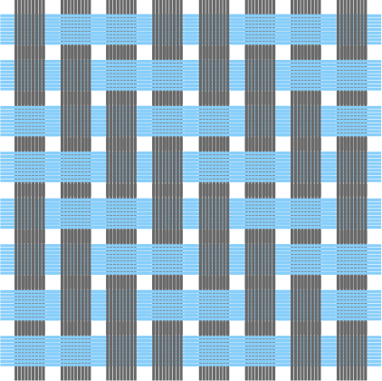
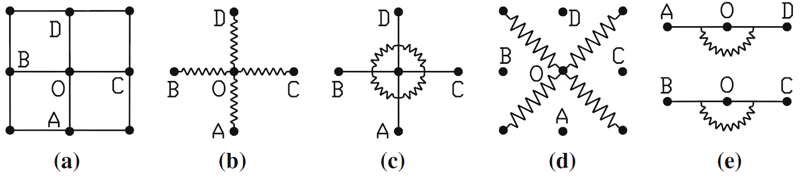
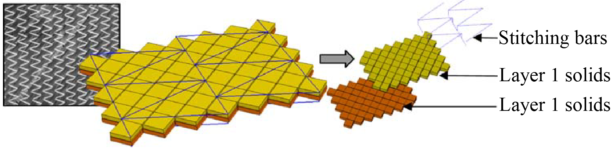

# Composite materials

## General presentation

A composite material is an assembly of two or more immiscible constituents whose properties meet specific needs not met individually by the basic components. This definition includes a wide range of materials, some natural and long used such as wood, bone or cob, and others more recently developed such as tires or reinforced concrete. All these materials have in common the fact that they are composed of two components: the reinforcement that gives the final product its dominant mechanical characteristics and the matrix that provides the cohesion of the whole. The will to use specific materials for each application, with the aim of optimizing costs and mechanical performance, makes composites a serious candidate.

The matrices of currently developed composite materials are generally classified into two categories:

- _Organic matrices_ (thermoplastic polymers, thermosets and elastomers). They represent the vast majority of matrices used industrially because of their low cost and ease of implementation.

- _Mineral matrices_ (ceramic and metallic). Ceramic and metallic matrices are intended for advanced applications. They are used when environmental conditions do not allow the use of an organic matrix (high temperatures, unfavorable hygrometry).

Reinforcements can be classified according to their geometry:

- _Particulate reinforcements_: the matrix is reinforced by a dispersed phase of particles with or without preferred orientation. These are generally granular (chalk), lamellar (talc, mica) or acicular (wallastonite, short fibres) inclusions. Composites with particulate reinforcement are rarely used for structural purposes, but rather for specific applications or for consumer products.

- _Staple fiber reinforcements_: the matrix is reinforced by a dispersed phase of short fibers (lengths less than 100 times their diameter) with or without a preferred orientation. The short fibers are assembled in layers called strands and represent a volume contribution in fiber of about 30%. The composite obtained is then a reinforced polymer.

- _Continuous fiber reinforcements_: the matrix is reinforced by a dispersed phase of continuous fibers whose length is close to that of the final part. The preferred directions of the fibers give the final part its main mechanical characteristics. In this type of reinforcement, the matrix is only present to ensure the cohesion of the whole and to bring a resistance to the efforts applied in directions different from those of the fibres.

Comfor allows to model at this moment only **Continuous fiber reinforcements**.

## Continuous fiber and organic matrix composites

Continuous fiber and organic matrix composites are widely used in industry, particularly in the military sector[@BHA06], aeronautics[@MAZ05] or in shipbuilding[@SMI90] [@MOU01]. Since a few years, the automotive sector also shows a growing interest for these materials in order to reduce the mass of the vehicles[@VER06] [@FUC08].

### The reinforcement

Depending on the purpose of the fiber, several types of compositions can be used as raw material. **Fibers** must be produced and then assembled into **yarns** that will be linked by weaving according to different patterns, the **reinforcement** is thus obtained.

The architecture of the reinforcement weave can be 2D (surface), 2.5D (interlocks) or 3D (three-dimensional). The first one corresponds to an interlacing of wicks according to two directions, the warp and the weft. The type of arrangement used is called reinforcement weave and is the traditional textile used in industry. For 3D weaves, a third sliver direction is added in the thickness of the reinforcement. Finally, the so-called 2.5D weaves are located at the border of the 2D and 3D reinforcements. Yarns will then seek in the upper and lower layers one or more weft rovings in order to link the layers together.

Depending on the manufacturing process, the addition of the matrix takes place before the forming step, like the thermoforming process, or after, this is the case of LCM (Liquid Composite Moulding) processes.

For 2D fabrics, there are three main weaves:

- _Cloth or taffeta_, the simplest weave: each warp thread passes alternately above and below each weft thread.

- _Twill_ NxM : the weft thread passes over N and then under M warp threads, shifting one thread at each pass.

- _Satin_: the binding points of the warp and weft are scattered in order to reduce the diagonal effect present on the twill. The weft thread passes over N warp threads and then under 1.

<figure>
    <figure >
      
      <figcaption>Taffeta</figcaption>
    </figure> 
    <figure  >
      
      <figcaption>Twill</figcaption>
    </figure>
    <figure  >
      
      <figcaption>Satin</figcaption>
    </figure>
    <figcaption>Caption for the bundle of images</figcaption>
</figure>

The combination of these three families of textile weaves and materials results in a wide variety of woven reinforcements. If the reinforcement is identical in the warp and weft direction, it is called a balanced fabric. Generally speaking, a fabric can be characterized by its _crimp_, the relative arrangement of the warps and wefts. The latter is defined by the ratio of the length of the fabric in one direction to the length of a yarn in that same direction. Different studies [@BUE98] [@BOI01] [@LOM05] [@HIV08] have been able to show the fundamental influence of crimp on the mechanical behavior of the reinforcements. The crimp factor is given by:

$$
e = \frac{l_{\text{yarn}}-l_{\text{weave}}}{l_\text{yarn}}
$$

Thick parts can be made with these 2D fabrics by superimposing them. The structure thus obtained allows to optimize the stiffness of the finished material by acting on the orientation of the plies. However, in this configuration, the final structure is subject to delamination.

In the case of 3D and 2.5D woven fabrics, the weft rovings cross several planes of warp rovings in the thickness of the material. The resulting woven fabric can then reach thicknesses of about ten centimeters and avoid delamination [@GU02]:

 <figure >
   
   <figcaption>Example of 3D fabrics</figcaption>
 </figure> 

### The matrix

Organic (synthetic) matrices are _polymer_ resins. These materials are composed of a series of repeating units called _monomers_, which join together in a chemical reaction known as polymerization to form macromolecular _chains_. The most commonly used polymers for composite material matrices belong to the family of thermosets and thermoplastics.

##### Thermosets

Thermosetting polymer resins are composed of cross-linked or three-dimensional macromolecular chains. Before heat treatment, the resin is in a liquid or past-like state at room temperature, which facilitates its handling and impregnation of the fibers.

After undergoing a heating cycle known as a polymerization cycle or cross-linking cycle, the resin becomes irreversibly solid. Thus, thermoset composite parts can be shaped only once since the matrix becomes infusible and insoluble after polymerization.

Thermoset resins are the most widely used in industry and have good mechanical properties and strength.

##### Thermoplastics

Thermoplastic matrices are composed of linear or one-dimensional chains and branched or two-dimensional chains. Unlike thermosetting resins, the material is usually in a solid state at room temperature. Under the influence of heat, the polymer can be softened and then melted and deformed, but can be returned to its original solid state by cooling without any chemical change (under certain conditions, e.g. oxidation). The transformation process is reversible and, therefore, the material and the manufactured parts can be potentially recycled.

Compared to thermoset matrices, thermoplastic matrix composites have many advantages:

- Equal or superior mechanical properties.
- Shorter forming cycle.
- Greater ease of storage.
- Reversibility and recycling.

The industrial development of thermoplastic matrix composite structures is now in full swing. This manuscript is part of the numerous works that are being developed to industrialize the manufacturing of such products.

#### Prepregs

Prepregs are the result of the combination of the reinforcement and a thermoplastic or thermoset polymer already joined together before forming.

As mentioned previously, one of the advantages of thermosets is the good impregnation of fibers due to its low viscosity at room temperature; whereas thermoplastics must be heated above the melting temperature and require a long compaction phase in order to properly impregnate the fibers. This step affects the forming cycle by increasing the consolidation time, necessary to remove porosities by compaction.

## Manufacturing processes

The manufacturing processes of composite materials are numerous and varied. From essentially manual processes, techniques have not stopped evolving to meet the growing use of these materials. The need for higher and higher production rates, or for parts with better controlled and optimized characteristics, have led to different types of processes which are chosen according to the need (shape, production rate, series, mechanical characteristics, etc.). The forming operations described below are based on the principle of molding, a process that allows obtaining structures with non-developable geometry.

As mentioned previously, depending on the manufacturing process, the addition of the matrix takes place before or after the deformation of the reinforcement. The main processes used in each case will be briefly described below. A more detailed explanation will be given for the process targeted in this work: thermoforming.

### Liquid Composite Moulding

The LCM (Liquid Composite Moulding) processes are used to shape woven and polymer matrix composites. Among these processes, vacuum infusion and RTM (Resin Transfer Moulding, [@POT99]) are the most used. The principle of these processes is to mold the dry reinforcement, then to inject the resin to solidify the part. The fact of molding the dry reinforcement makes it possible to obtain a final composite part very close to the desired part, and thus to minimize the machining steps and thus the costs. These processes, known as "closed mould processes", allow a strict control of volatile organic compounds emitted during the manufacturing process, as the resin is not in direct contact with the atmosphere.

#### Vacuum infusion

In vacuum infusion, the dry woven reinforcement is placed between a mold and a waterproof membrane, as described [1.10](#fig:1_Infusion){reference-type="ref" reference="fig:1_Infusion"}. By evacuating this area, the pump will press the reinforcement against the mold through the membrane and start the resin flow. A drainage net, made of a porous material, is placed near the reinforcement in order to facilitate the distribution of the resin. This process is easier to implement than RTM, and allows the production of parts in large series with good repeatability on complex shapes. However, thickness control is difficult and the surface finish on the membrane side is generally worse than the molded side.

 <figure >
   
   <figcaption>Vacuum infusion</figcaption>
 </figure> 

#### Resin transfer moulding

The manufacturing process can be broken down into three steps, as illustrated in [1.11](#fig:1_RTM){reference-type="ref" reference="fig:1_RTM"}.

The first step is the preforming step. It consists in shaping (or stamping) a woven reinforcement in a mold by means of a punch. The advantage of this process is to have two rigid parts which will allow to better control the compression of the reinforcement during the shaping and thus its final thickness. Contrary to vacuum infusion, the surface finish is good on both sides. In order to avoid wrinkles during the stamping process, blank holders can be used by adding a slight tension in the rovings.

Once the reinforcement is molded into the desired shape, the resin is injected. The assembly is then heated to cure the resin. Finally, when the resin is consolidated, the mold is opened and the part demolded.

This process is undergoing a strong development with the objective of being used for mass production parts because it allows a control of the volume rate of fiber, a good surface finish, the creation of complex geometries and sustained and automated production rates. However, despite its use in industry, this process is not fully controlled for complex shapes (non-developable for example) or large sizes. These elements lead aerospace and automotive industries to take a great interest in the development and research associated with the process.

 <figure >
   
   <figcaption>RTM Process</figcaption>
 </figure> 

### Thermoforming

In order to exploit the excellent properties of CFRTP composites in an industrial context, different manufacturing processes have been developed depending on the product and its application. Most of these methods are an adaptation of the processes for the shaping of thermoset composites or of the classical stamping techniques. In the case of forming flat structures, roll forming and simple compression have already been mentioned. In the case of constant section structures, we can mention pultrusion forming, which is a continuous manufacturing process where the profile is obtained by pulling the prepreg reinforcement through a heated die, or filament winding forming, whose functional principle is shown in [1.12](#fig:1_winding){reference-type="ref" reference="fig:1_winding"}[@MAC12]. These processes allow the shaping of simple parts (1D and 2D) and are easily automated.

 <figure >
   
   <figcaption>Thermoplastic filament winding production line</figcaption>
 </figure> 

In order to manufacture structures with non-developable (3D) geometry, thermoforming appears to be an ideal candidate.

The term "thermoforming" encompasses a variety of manufacturing processes ranging from molding by applying pressure or vacuum to a flexible diaphragm, to hydroforming or thermostamping. However, the operating principle is essentially the same. A plate consisting of one or more initially flat prepreg layers is heated and then shaped by applying pressure. The plate can be pre-consolidated, which ensures a good degree of consolidation after shaping with less production time. In the following, the thermoforming process by deep drawing or thermostamping will be described.

Thermoforming is a very interesting solution for the mass production of composite structures. Indeed, being an adaptation of the shaping of metal sheets by stamping, there is the possibility of reusing the already existing equipment as well as its automation system [@CAM10].

The first step in thermoforming is to heat the material above its melting temperature. The main methods used for preheating are infrared (IR) lamps, convection ovens, and heated platen presses. IR heating is the most popular. The heating time is very short (1 to 2 minutes). However, temperature gradients in the thickness can appear which are managed by imposing a progressive heating (preheating cycle). A second constraint associated with this method is the poor temperature distribution in the case of complex geometries. In the case of thin structures, IR heating is well suited. On the other hand, convection heating is slow (5-10 min) but a homogeneous temperature distribution is obtained in the thickness at the end of heating. Finally, conduction heating is rarely used, because the material tends to stick to the heating plates.

After heating, the material is transported to the press. The transfer time is a critical parameter. The material must be transported to the press as quickly as possible to prevent the material from cooling above its crystallization temperature. Today's automation systems such as conveyors and robots help to reduce this time. The temperature loss in this step is about 10%. This is usually compensated by overheating the material in the first step. The material is then shaped.

During forming, the reinforcement is deformed by applying pressure between two complementary tools which are the impression of the final structure, the punch and the die. These tools are usually equipped with a system to maintain a constant temperature below the melting point. The forming process takes a few seconds. The part is then maintained under pressure to remove porosities and ensure cohesion between the different layers and cooled down to a temperature that allows the dimensional stability of the part. This is the consolidation phase. The structure is finally demolded and continues to cool in ambient air. All the phases are shown in [1.13](#fig:1_thermoforming){reference-type="ref" reference="fig:1_thermoforming"} and [1.14](#fig:1_stamping_old){reference-type="ref" reference="fig:1_stamping_old"}

All the steps are carried out in a few minutes, this time can be further reduced if the production line allows the manufacture of two parts at the same time, one on the heating module and one on the shaping module. All these characteristics make thermostamping a prime candidate for the mass production of composite parts, especially in the automotive sector.

However, the optimal automation of the process implies that the physical phenomena involved are mastered. Double curvature structures present different types of defects that are difficult to predict. In order to avoid the "trial and error" method, numerical modeling is a beneficial step.

It is clear that temperature is an essential factor since it modifies the behavior of the resin. The mechanical properties and particular deformation mechanisms of the material, due to the fibrous nature of the reinforcement, are constantly evolving.

 <figure >
   
   <figcaption>Thermo-stamping steps</figcaption>
 </figure> 

 <figure >
   
   <figcaption>Thermo-stamping chain</figcaption>
 </figure> 

## Modeling and Simulation approaches.

Modeling and numerical simulation of the forming process are two important steps to predict the feasibility of different parts, but also to understand and improve the process itself. As mentioned earlier, the quality of the resulting parts depends greatly on the settings of the parameters that control the forming operations. Thus, during the design of a product, it is necessary to call upon trial and error campaigns, which are all the more costly as the part is complex and of large dimensions. The objective of the simulation is to predict the geometrical and mechanical characteristics likely to appear during the shaping process such as

- the position of the strands and fibers after deformation

- the mechanical characteristics of the deformed reinforcement

- the possible appearance of folding, unweaving, fiber breakage

The simulation also allows to determine the ideal conditions in order to optimize both the process and the quality of the structure (temperature, forming speed, initial size and geometry of the reinforcement, etc.).

These characteristics and defects are not all defined at the same scale: a fiber break is a microscopic phenomenon difficult to detect when the scale of observation is macroscopic, as well as a wrinkle (macroscopic phenomenon) cannot be detected at the microscopic scale. Therefore, different types of simulations have been developed, each one being placed at a precise scale of the reinforcement:

- The _microscopic_ scale: study of the fibers and their interactions. Only a few hundred fibers per strand can be simulated at most

- The _mesoscopic_ scale: study of the behavior of the sliver in order to determine the local characteristics of the reinforcement. The simulated volumes are generally of the order of the elementary mesh of the reinforcement

- The _macroscopic_ scale: study of the deformation of the reinforcement as a whole, in order to characterize the appearance of folds, slippage of the strands and more generally the formability of a complex geometry part.

### Modeling at the microscopic scale

In a microscopic scale approach, the basic component is the fiber. The behavior of the fiber is linear orthotropic and its characteristic quantities are relatively well known. The difficulty of this type of approach is the management of the numerous bodies constituting the model, especially in the management of the contact between them.

Currently, the existing models that come closest to modeling the behavior of reinforcements at the microscopic scale are those performed on ropes or cables, which are similar to strands containing fewer fibers and strongly twisted [@JIA99] [@NAW00] [@SRE06] [@GHO07]. On the other hand, the application to reinforcement rovings is rarer [@LAT11], mainly because of the high number of fibers per roving. However, we can mention the weaving model developed by Zhou [@ZHO04]([1.15](#fig:1_ZHO04){reference-type="ref" reference="fig:1_ZHO04"}) and Durville [@DUR10]([1.16](#fig:1_DUR10plain){reference-type="ref" reference="fig:1_DUR10plain"}).

The main limitation of this type of approach is the computational time inherent to the number of fibers to model. For this reason, groups of fibers are modeled in the wicks, reducing the number of virtual fibers to a few tens instead of thousands of real fibers. Therefore, the simulation of the shaping of a large part with this approach is not feasible in the current state of research.

<figure>
    <figure >
      
      <figcaption>Zhou model</figcaption>
    </figure> 
    <figure  >
      
      <figcaption>Durville model </figcaption>
    </figure>
    <figcaption>Microscopic modelling</figcaption>
</figure>

### Mesoscopic simulation

Models at the mesoscopic scale are interested in the behavior of an elementary mesh of the reinforcement. At this scale, the wick is considered as a continuous medium. The objective of these models is to determine certain behaviors or properties of the reinforcement that are difficult or expensive to determine experimentally. Among these properties, the most sought after are :

- the macroscopic mechanical behavior of the reinforcement, allowing in particular to feed the models at the macroscopic scale.

- the local permeability of the reinforcement as a function of the deformation of the elementary mesh [@LOI08], allowing to feed simulations of the resin flow in the reinforcement in the case of LCM type processes.

- The macroscopic thermal properties of the material (with or without taking into account the matrix) for the simulation of thermal exchanges, such as the macroscopic thermal conductivity [@DAS92] [@DAS96] [@BIG01].

Analytical approaches have been developed to access these thermomechanical and geometrical quantities. These approaches are generally based on a simplification of the wick geometry in the elementary mesh and on assumptions of mechanical or thermal behavior.

The next figures shows an example using this type of approach proposed by Kawabata [@KAW73] [@KAW80]. The roving is described by a set of segments schematizing its mean line: these segments then form a set of elastic tensile bars representing the whole woven reinforcement. The interactions between the rovings at the crossing points are modeled by springs of different types.

<figure>
    <figure >
      
      <figcaption>Structure to model</figcaption>
    </figure> 
    <figure  >
      
      <figcaption>Analytical modelling</figcaption>
    </figure>
    <figcaption>Mesoscopic modelling</figcaption>
</figure>

Analytical approaches provide consistent results in determining the mechanical behavior of wicks in tension, but are more limited in more complex applications where shear is involved, for example. Simplifying assumptions about the geometry, especially at the level of lateral contacts, are problematic.

Faced with these limitations, the use of finite elements seems a good alternative. Their use at this scale requires two prerequisites: the geometry and the boundary conditions of the reinforcement. The geometry must be obtained theoretically from the characteristics of the wick and the armor, or experimentally.

Many models have been developed to obtain the final geometry. We note the models associated with the software _WiseTex_ developed at the Katholieke Universiteit Leuven [@LOM00] [@LOM06] and _Texgen_ developed at the University of Nottingham [@SHE07]. In the case of _WiseTex_, the geometry of the reinforcement is obtained by minimizing the strain energy of the strands within the reinforcement by taking into account different mechanical contributions (tension, bending, torsion, compression of the strands and interactions). This approach requires the experimental identification of data that are difficult to obtain. The models made with _Texgen_ , unlike _WiseTex_, do not use mechanical considerations. However, it allows to easily realize elementary meshes of 2D and 3D woven fabrics in which the wicks can have variable non-symmetric sections along their mean line. For both approaches, the problem of interpenetration, although reduced under _WiseTex_ [@VER05], remains major.

<figure>
    <figure >
      
      <figcaption>Structure to model</figcaption>
    </figure> 
    <figure  >
      
      <figcaption>Analytical modelling</figcaption>
    </figure>
    <figcaption>Mesoscopic modelling</figcaption>
</figure>

X-ray microtomography is the most promising method to experimentally access the geometry of an elementary mesh [@BAR00] [@DES05] [@HSI09] [@HER80] [@KHA14]. This technique consists in scanning a representative sample of a reinforcement in order to obtain a 3D cartography and then to process the images obtained by cutting the constituent elements (the strands), separating them from each other and meshing them. Microtomography has the great advantage of being able to lead to interpenetration-free modeling if the appropriate digital treatments are performed [@NAO14] [@NAO15]. An example of automation of the processing of microtomographic fabrics is shown [\[fig:1_NAO14\]](#fig:1_NAO14){reference-type="ref" reference="fig:1_NAO14"}.

<figure>
    <figure >
      
      <figcaption>3D tomography of an interlock</figcaption>
    </figure> 
    <figure  >
      
      <figcaption>Mesh part</figcaption>
    </figure>
    <figcaption>Mesoscopic modelling</figcaption>
</figure>

<!-- {#fig:1_NAO14ini2 width="\textwidth"}.
{#fig:1_NAO14fin2 width="\\textwidth"} -->

Once the geometry is defined and discretized by finite elements, it is necessary to associate a behavior law to the wicks, which are in most cases considered as a continuous medium. This behavior is very specific due to the fibrous nature of the fibers. Most studies use hypoelastic [@GAS00] or hyperelastic [@CHA11] models to describe this behavior.

At this scale, modeling the entire woven reinforcement during forming is still difficult. However, the study of an elementary pattern or cell representative of the structure (CER) will allow to understand the behavior of the weaving at a smaller scale before extending it to the whole part. This is the case of modeling by homogenization and multi-scale calculations [@GEE03] [@OZD08].

### Macroscale modeling

The objective of macroscale simulation is to simulate the shaping of woven reinforcements at the scale of the entire part. The study of formability consists in predicting the appearance of the various defects observable on the woven fabrics. The number of defects that can be obtained depends both on the type of modeling approach chosen and on the richness of the mechanical characteristics given to them. These characteristics can be derived from tests performed at the woven fabric scale or from observations/simulations at smaller, microscopic and mesoscopic scales. The reuse of results obtained at smaller scales is the main reason for the existence of the corresponding models. Among the known macroscopic approaches, there are geometrical and mechanical approaches.

#### Geometrical approaches

Geometric approaches are based on the so-called fishnet algorithm. This so-called geometric or kinematic approach is mainly used for the simulation of dragging. Its simplicity of use and its speed of execution make it a good method of first approach [@MAR56] [@VAN91]. It is based on strong assumptions:

- The inextensibility of the rovings ;

- The non-slip between warp and weft;

- The free rotation at the crossing points between networks;

- The absence of slippage between the woven fabric and the shaping tools.

In this approach, the reinforcement is similar to hinged bars at the crossing points between networks[@BOI04]. As shown in [1.23](#fig:1_Filet){reference-type="ref" reference="fig:1_Filet"}, the algorithm determines the position of a curant point C from the intersection of the two geodesics drawn on the surface to be draped from the related points A and B. The position of the initial point is thus made paramount and influences the final result [@WAN99].

 <figure >
   
   <figcaption>Geometrical approach</figcaption>
 </figure> 

<!-- {#fig:1_Net} -->

With the removal of all mechanical and weaving considerations, the results are identical whatever the stiffness of the rovings and the weave chosen. Kinematic blocking in shear and thickness variation in compression are also absent from the basic model. The absence of developed contact prevents the use of external tools such as blanket clamps, which are necessary for some shaping. For woven reinforcements, the net algorithm is interesting as a preliminary approach to determine the degree of complexity of forming a part. An example of application on a non-developable part is given [\[fig:1_BOR03\]](#fig:1_BOR03){reference-type="ref" reference="fig:1_BOR03"}.

<figure>
    <figure >
      
      <figcaption>Geometrical part</figcaption>
    </figure> 
    <figure  >
      
      <figcaption>Simulation</figcaption>
    </figure>
    <figcaption>Geometrical approach</figcaption>
</figure>

<!-- {#fig:1_FiletDrappagePiece width="69%"}
{#fig:1_FiletDrappage width="69%"} -->

#### Mechanical approaches

Among the mechanical models, three types of approaches can be distinguished: discrete, semi-discrete or continuous.

The _discrete_ approaches consist in considering the textile as a discontinuous assembly of deformable elements [@BOU07]. They are generally extensions of the net theory, i.e. the introduction of mechanical characteristics in the solution of the shaping problem. The reinforcement is modeled by nodes connected by bars and springs with the aim of modeling the response in elongation, shear, torsion and bending. The work of Sze and Liu [@SZE05] is particularly interesting on the variety of solicitations modeled for 2D dry reinforcements, as illustrated in the following figure. These approaches, generally encountered for clothing fabrics, are abandoned in favor of semi-discrete or continuous methods in the case of technical fabrics.

 <figure >
   
   <figcaption>Sze Discret approach</figcaption>
 </figure> 

The application of this type of approach in the case of thermoplastic prepreg composites results in the modification of the mechanical behavior of the discrete elements that compose the reinforcement, in order to take into account the contribution of the matrix. We note the model proposed by Skordos [@SKO07] based on the work of Sharma [@SHA04], which introduces nonlinear elastoviscoplastic elements in order to take into account the specific behaviors of prepregs, such as the dependence on the strain rate.

<figure>
    <figure >
      
      <figcaption>Meshing</figcaption>
    </figure> 
    <figure  >
      
      <figcaption>Simulation</figcaption>
    </figure>
    <figcaption>Skordos discret approach</figcaption>
</figure>

<!-- {#fig:1_skordos1 width="\\textwidth"}

{#fig:1_skordos2 width="\\textwidth"} -->

The _continuous_ approaches make the assumption of a continuous material at the macroscopic scale. This assumption follows directly from the consideration of non-slip between rovings during the shaping phase. The consideration of the textile as a continuous anisotropic medium whose behavior is homogenized from lower scales is then possible. The modeling is focused on an adapted proposal of behavior laws.

Different approaches, either hypoelastic [@PEN05] [@BAD08] [@KHA10] or hyperelastic [@SPE72] [@THI07] [@DRI10] [@CHA12], have given good results. These laws are associated with shell or plate elements for thin woven fabrics, and with bricks for thick woven fabrics. These methods have the advantage that they can be easily used in commercial finite element codes. Their main disadvantage comes from the homogenization that is performed. The same material is applied at all points of the fibrous reinforcement to be modeled and does not take into account the variations of the mechanical characteristics inherent to the weave studied.

 <figure >
   
   <figcaption>Khan continuous approach</figcaption>
 </figure> 

<!-- {#fig:1_KHA10 width="90%"} -->

Most of the proposed continuous models for the shaping of prepreg composites are based on the so-called IFRM (_ideal fiber reinforced model_) assumptions. IFRM was originally proposed by Spencer for purely elastic responses [@SPE84] and adapted by Rogers [@ROG89] and Johnson [@JOH95] to the viscoelastic behavior of unidirectional and bidirectional prepregs. Two important assumptions are made in this type of model: the incompressibility of the material and the inextensibility of the fibers. Therefore, the only _deformation mode_ considered is in-plane shear. This can be seen as the rotation of the rovings around the crossing points of the warp-weft networks (lattice effect).

In the case of woven reinforcements, the stress state is given by the following relationship [@SPE00]:

$$
\begin{split}
\mathbf{ \sigma }  =  &- p\mathbf{ I}  + {T_A}\mathbf{ A}  + {T_B}\mathbf{ B} \\
  &+ 2{\eta _{\mathrm{1}}}\mathbf{ D}  + 2{\eta _{\mathrm{2}}}\left( {\mathbf{ A} {\kern 1pt} \mathbf{ D}  + \mathbf{ D} {\kern 1pt} \mathbf{ A}  + \mathbf{ B} {\kern 1pt} \mathbf{ D}  + \mathbf{ D} {\kern 1pt} \mathbf{ B} } \right) + 2{\eta _3}\left( {{\mathrm{tr}}\mathbf{ C} {\kern 1pt} \mathbf{ D} } \right)\left( {\mathbf{ C}  + {{\mathbf{ C} }^T}} \right)
\end{split}
$$

$\mathbf{{A}}  = \mathbf{a}\otimes \mathbf{a}$, $\mathbf{{B}}  = \mathbf{b}\otimes \mathbf{b}$ and $\mathbf{{C}}  = \mathbf{a}\otimes \mathbf{b}$, $\mathbf{a}$ et $\mathbf{b}$ being the directions of the fibers in the warp and weft direction respectively.

The first term of the previous relation represents an arbitrary hydrostatic pressure induced by the assumption of incompressibility of the material, similarly, $T_A$ and $T_B$ are arbitrary stresses in the direction of the fibers resulting from the inextensibility stress. The scalars $\eta_\mathrm{1}$ , $\eta_\mathrm{2}$ and $\eta_\mathrm{3}$ can be interpreted as the viscosity parameters of the material, possibly as a function of the strain rate tensor $\mathbf{{D}}$ (non-linear viscosity). The identification of these parameters from experimental tests, either in the one-dimensional case [@GOS96] [@ADV97] [@CHR93] [@MAR95] or in the two-dimensional case [@OB91] [@MCG97] [@MCG98], has been the subject of much work. However, difficulties have been encountered mainly due to the fact that $\eta_\mathrm{1}$ , $\eta_\mathrm{2}$ and $\eta_\mathrm{3}$ are not associated with simple shear mechanisms. In order to correctly represent the different _flows_ associated with the main deformation modes of the tissue, different modifications have been proposed [@MAL00].

The models developed under IFRM principles give very interesting analytical results in the case of simple deformations. However, the constraint associated with the non-extensibility of the fibers makes its implementation by finite elements difficult because of the arbitrary tensions. This last point has motivated the development of various models in order to make the implementation more suitable for the simulation of thermoforming of complex parts by finite elements [@HSI99] [@CHE01] [@THI07] [@JAU09] [@HAR04a] [@HAR11] [@GUZ15].

The _semi-discrete_ approaches are a combination of the two approaches mentioned above. One part of the behavior is modeled with a continuous solid while another part is modeled with discrete inputs. One can then distinguish two philosophies in the interaction between discrete and continuous parts.

In the first case, the discrete and continuous parts are associated in the same Lagrangian element. The forces generated by any deformation are subdivided between a tension contribution associated with the discrete parts and the other contributions (shear, compression) associated with the continuous part. The discrete and continuous parts are fixed with respect to each other in the isoparametric configuration. In this case, the discrete part is only the elementary representation of an energy contribution of tension. Different models have been developed, dedicated to 2D fabrics using plate elements [@HAM08] [@HAM09] [@BEL12], but also to interlocks using solid elements (hexahedral) [@LUY09]. The interest of such an element is to be able to represent more accurately and simply the local directions of the wicks in the preform and to account for the complex anisotropy of these materials.

<figure>
    <figure >
      
      <figcaption>Semi-discrete finite element</figcaption>
    </figure> 
    <figure  >
      
      <figcaption>Simulation</figcaption>
    </figure>
    <figcaption>Hamila discret approach</figcaption>
</figure>

<!-- {#fig:1_LUY09a_2 width="\textwidth"}
{#fig:1_LUY09b width="90%"} -->

Another modeling strategy considers discrete and continuous parts as totally independent. This is the case, for example, of work on NCFs [@CRE06]. These specific woven fabrics are made of sewn webs. In this modeling, the roving plies are represented by layers of solid elements while bar elements are added to represent the seams. Here, the continuous parts are totally decoupled from the discrete parts, implying the management of the contact between the webs and the seams.

 <figure >
   
   <figcaption>Creech NCF semi-discrete model</figcaption>
 </figure> 

<!-- {#fig:1_CRE06 width="90%"} -->

## References

\bibliography
