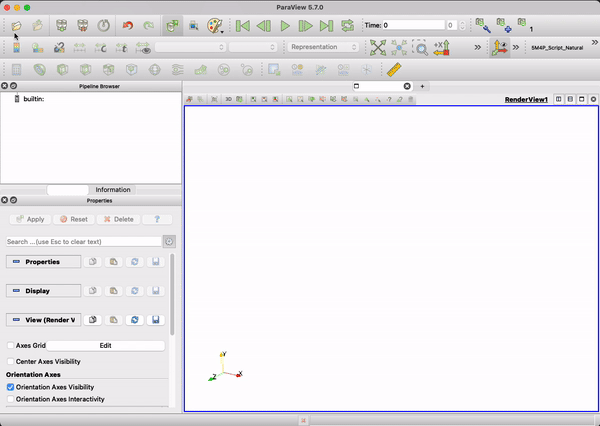
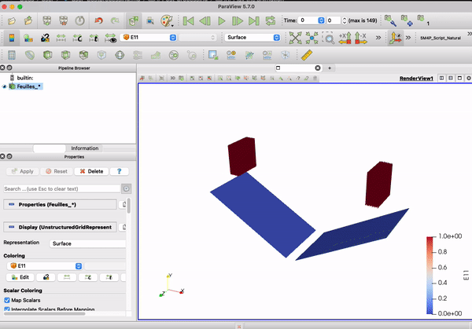

Le format [VTK](http://www.vtk.org/VTK/img/file-formats.pdf) est utilisé par
défaut pour l’exportation des résultats. D’autres formats pourront être pris en
charge à l’avenir, en fonction des besoins des utilisateurs et des chercheurs.

Au cours de la simulation, Comfor génère plusieurs fichiers `.vtk`, un à chaque
[`print_step`](user_preprocessing.md#controle_de_temps). Ces fichiers sont enregistrés
dans le dossier `Results_<nom_du_fichier>`.


_Exemple_

```console
Project_name
  |
  |---in_file.bim
  |---Results_in_file
  |     |--- in_file_0.vtk
  |     |--- in_file_1.vtk
  |     |--- in_file_2.vtk
       ...
```

# Chargement des fichiers de résultats

Pour visualiser les résultats, ouvrez *ParaView*. Cliquez sur le menu *File →
Open* et recherchez le dossier `Results_<nom_du_fichier>`.Comme Comfor nomme les
fichiers dans l’ordre croissant, ParaView proposera de les ouvrir en tant que
groupe.

<div style="text-align:center;">
    <figure>
        
        <figcaption>Chargement des fichiers</figcaption>
    </figure>
</div>

# Lire l’animation

# Lire l’animation

Une fois les fichiers ouverts, ParaView crée une scène dans le  
[`Pipeline Browser`](https://www.paraview.org/ParaView/index.php/Pipeline_Browser_Ideas).
Si le maillage n’est pas affiché, cliquez sur *Apply* dans la section des
propriétés.

!!! hint
    
    Activez l’option **Auto Apply** dans *ParaView Preferences → General →
    Properties Panel Options* pour appliquer automatiquement les changements.

Pour lancer l’animation, cliquez sur le bouton *Play* dans la barre VCR. La
barre temporelle affiche le resultat courant. Vous pouvez également naviguer pas
par pas, aller à la première ou à la dernière image, ou activer la lecture en
boucle.

Les données à afficher peuvent être sélectionnées dans la barre *Data Analysis*.  
Une liste déroulante permet de choisir les variables scalaires ou vectorielles,
définies aux nœuds ou aux éléments. Ce paramètre peut aussi être modifié dans
les propriétés, section *Coloring*.  
Les cartes de couleurs peuvent être ajustées pour améliorer la lisibilité.
.

<div style="text-align:center;">
    <figure>
        
        <figcaption>Lecture de l’animation</figcaption>
    </figure>
</div>

# Application de filtres

Paraview propose une série de
[filtres](https://www.paraview.org/Wiki/ParaView/Users_Guide/List_of_filters)
permettant de manipuler et traiter les données. Ces filtres peuvent être
combinés en cascade. Pour appliquer un filtre, allez dans _Filters →
Alphabetical_ ou recherchez par catégorie. Les filtres les plus courants pour
notre application sont :

- `Connectivity` : identifie les régions connectées du maillage. Ce filtre
  attribue un identifiant de région aux composants connectés. On l’utilise pour
  séparer les solides des plaques composites.
- `Threshold` : extrait les éléments dont les valeurs scalaires (nœud ou
  élément) sont dans une plage spécifiée. Sélectionnez le filtre, définissez le
  champ scalaire, la plage, puis cliquez sur Apply.
- `Cell to data point` : interpole les données des éléments aux nœuds en
  moyennant les valeurs des éléments voisins.
- `Temporal interpolator` : interpole la solution entre deux images pour créer
  des animations fluides.
- `Plot data` : trace des courbes à partir de tableaux de données. Utilisez ce
  filtre pour tracer des fichiers CSV dans des graphes XY.

<div style="text-align:center;">
    <figure>
        
        <figcaption>Application des filtres</figcaption>
    </figure>
</div>

# Pour aller plus loin

Consultez les tutoriels en ligne suivants :

- [Tutoriel officiel de Paraview](https://www.paraview.org/Wiki/The_ParaView_Tutorial)
- [Tutoriels de Cyprien Rusu](https://youtube.com/playlist?list=PLvkU6i2iQ2fpcVsqaKXJT5Wjb9_ttRLK-)
